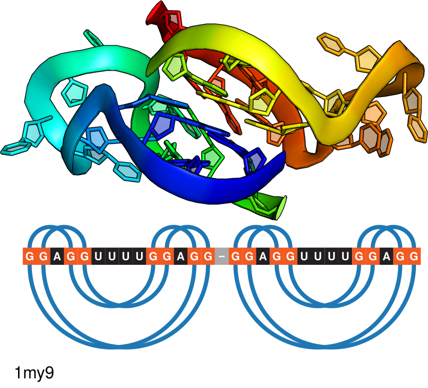

# Project description

This is an application to analyze base pairing patterns of DNA/RNA 3D
structures to find and classify tetrads and quadruplexes. ElTetrado
assigns tetrads to one of the ONZ classes (O, N, Z) alongside with the
directionality of the tetrad (+/-) determined by the bonds between bases
and their non-canonical interactions. The interactions follow
Leontis/Westhof classification (Leontis and Westhof, 2001). Watson-Crick
(W) edge of first base in the tetrad structure exposed to the Hoogsteen
(H) edge of the next nucleobase from the same tetrad sets the tetrad
directionality, clockwise (+) or anticlockwise (-). For more details,
please refer to Zok *et al.* (2020) and Popenda *et al.* (2020)

# Installation

Please run:

    pip install eltetrado

If you have both Python 2 and Python 3 installed, you need to explicitly
call `pip3`:

    pip3 install eltetrado

# Dependencies

The project is written in Python 3.6+ and requires
[Biopython](https://biopython.org/) and [NumPy](https://numpy.org/) in
to run.

ElTetrado depends on DSSR (Lu *et al.*, 2015) in terms of detection of
base pairing and stacking. The binary `x3dna-dssr` can be
[downloaded](http://forum.x3dna.org/site-announcements/download-instructions/)
and it needs to be put in `$PATH` i.e. typically in `/usr/bin`.
Alternatively, one can pre-process the 3D data with `x3dna-dssr --json`
and provide the path to a JSON result as an input to ElTetrado (see
Usage section below).

Visualization is created by `R` 3.6+ script which uses
[R4RNA](https://www.e-rna.org/r-chie/) (Lai *et al.*, 2012) library. The
dependency will be automatically installed if not present.

# Usage

ElTetrado is a command line application, which requires to be provided
with:

-   either `--dssr-json` and the path to JSON generated with
    `x3dna-dssr --json` (fast, but quadruplex parameters like `rise` or
    `twist` are not calculated)
-   or `--pdb` and the path to PDB or PDBx/mmCIF file (slow, because the
    execution time is a sum of ElTetrado and DSSR times)
-   or both `--pdb` and `--dssr-json` (recommended, all analyses are
    made and only ElTetrado is executed while DSSR results are read from
    the file)

By default, ElTetrado outputs textual results on the standard output. A
JSON version of the output can be obtained with `--output` switch
followed by a path where the file is supposed to be created.

ElTetrado prepares visualization of the whole structure and of each
N4-helices, quadruplexes and tetrads. This can be supplemented with
canonical base pairs visualization when `--complete-2d` is set. All
color settings are located in the first several lines of the `quadraw.R`
file, you can easily change them without knowledge of R language. If you
want ElTetrado to not visualize anything, pass `--no-image` switch to
it.

# Chains reorder

ElTetrado keeps a global and unique 5’-3’ index for every nucleotide
which is independent from residue numbers. For example, if a structure
has chain M with 60 nucleotides and chain N with 15 nucleotides, then
ElTetrado will keep index between 0 and 74 which uniquely identifies
every nucleotide. Initially, ElTetrado assigns this indices according to
the order of chains in the input file. Therefore, if M preceded N then
nucleotides in M will be indexed from 0 to 59 and in N from 60 to 74.
Otherwise, nucleotides in N will be indexed from 0 to 14 and in M from
15 to 74.

When `--no-reorder` is present, this initial assignment is used.
Otherwise, ElTetrado exhaustively checks all permutations of chains’
orders. Every permutation check induces recalculation of the global and
unique 5’-3’ index and in effect it changes ONZ classification of
tetrads.

ElTetrado keeps a table of tetrad classification scores according to
these rules:

-   Type preference: `O` > `N` > `Z`
-   Direction preference: `+` > `-`

The table keeps low values for preferred classes i.e. `O+` is 0, `O-` is
1 and so on up to `Z-` with score 5. For every permutation of chain
orders, ElTetrado computes sum of scores for tetrads classification
induced by 5’-3’ indexing. We select permutation with the minimum value.

# Examples

## 1MY9: Solution structure of a K+ cation stabilized dimeric RNA quadruplex containing two G:G(:A):G:G(:A) hexads, G:G:G:G tetrads and UUUU loops



    $ curl ftp://ftp.wwpdb.org/pub/pdb/data/structures/divided/mmCIF/my/1my9.cif.gz | gzip -d > 1my9.cif
    $ ./eltetrado --pdb 1my9.cif --output 1my9.json

    Chain order: A, B
    n4-helix with 4 tetrads
      Op+ VIII 1a quadruplex with 2 tetrads
        B.G16 B.G19 B.G25 B.G28 cWH-cWH-cWH-cWH O+ VIIIa planarity=0.31 ions_channel= ions_outside={}
          direction=parallel rise=4.21 twist=33.45
        B.G15 B.G18 B.G24 B.G27 cWH-cWH-cWH-cWH O+ VIIIa planarity=0.26 ions_channel= ions_outside={}

        Tracts:
          B.G25, B.G24
          B.G28, B.G27
          B.G16, B.G15
          B.G19, B.G18

        Loops:
          propeller- B.A17
          propeller- B.U20, B.U21, B.U22, B.U23
          propeller- B.A26

      Op+ VIII 1a quadruplex with 2 tetrads
        A.G1 A.G4 A.G10 A.G13 cWH-cWH-cWH-cWH O+ VIIIa planarity=0.63 ions_channel= ions_outside={}
          direction=parallel rise=4.12 twist=27.15
        A.G2 A.G5 A.G11 A.G14 cWH-cWH-cWH-cWH O+ VIIIa planarity=0.5 ions_channel= ions_outside={}

        Tracts:
          A.G4, A.G5
          A.G10, A.G11
          A.G13, A.G14
          A.G1, A.G2

        Loops:
          propeller- A.A3
          propeller- A.U6, A.U7, A.U8, A.U9
          propeller- A.A12


    GGAGGUUUUGGAGG-GGAGGUUUUGGAGG
    ([.)]....([.)]-([.)]....([.)]
    ([.([....)].)]-([.([....)].)]

<details>
<summary>
Click to see the output JSON
</summary>

``` json
{
  "metals": "",
  "nucleotides": {
    "A.G1": {
      "index": 1,
      "model": 1,
      "chain": "A",
      "number": 1,
      "icode": " ",
      "molecule": "RNA",
      "full_name": "A.G1",
      "short_name": "G",
      "chi": -114.063,
      "glycosidic_bond": "anti"
    },
    "A.G2": {
      "index": 2,
      "model": 1,
      "chain": "A",
      "number": 2,
      "icode": " ",
      "molecule": "RNA",
      "full_name": "A.G2",
      "short_name": "G",
      "chi": -136.905,
      "glycosidic_bond": "anti"
    },
    "A.A3": {
      "index": 3,
      "model": 1,
      "chain": "A",
      "number": 3,
      "icode": " ",
      "molecule": "RNA",
      "full_name": "A.A3",
      "short_name": "A",
      "chi": -53.884,
      "glycosidic_bond": "syn"
    },
    "A.G4": {
      "index": 4,
      "model": 1,
      "chain": "A",
      "number": 4,
      "icode": " ",
      "molecule": "RNA",
      "full_name": "A.G4",
      "short_name": "G",
      "chi": 167.763,
      "glycosidic_bond": "anti"
    },
    "A.G5": {
      "index": 5,
      "model": 1,
      "chain": "A",
      "number": 5,
      "icode": " ",
      "molecule": "RNA",
      "full_name": "A.G5",
      "short_name": "G",
      "chi": -98.198,
      "glycosidic_bond": "anti"
    },
    "A.U6": {
      "index": 6,
      "model": 1,
      "chain": "A",
      "number": 6,
      "icode": " ",
      "molecule": "RNA",
      "full_name": "A.U6",
      "short_name": "U",
      "chi": -150.069,
      "glycosidic_bond": "anti"
    },
    "A.U7": {
      "index": 7,
      "model": 1,
      "chain": "A",
      "number": 7,
      "icode": " ",
      "molecule": "RNA",
      "full_name": "A.U7",
      "short_name": "U",
      "chi": -130.523,
      "glycosidic_bond": "anti"
    },
    "A.U8": {
      "index": 8,
      "model": 1,
      "chain": "A",
      "number": 8,
      "icode": " ",
      "molecule": "RNA",
      "full_name": "A.U8",
      "short_name": "U",
      "chi": -158.504,
      "glycosidic_bond": "anti"
    },
    "A.U9": {
      "index": 9,
      "model": 1,
      "chain": "A",
      "number": 9,
      "icode": " ",
      "molecule": "RNA",
      "full_name": "A.U9",
      "short_name": "U",
      "chi": -149.743,
      "glycosidic_bond": "anti"
    },
    "A.G10": {
      "index": 10,
      "model": 1,
      "chain": "A",
      "number": 10,
      "icode": " ",
      "molecule": "RNA",
      "full_name": "A.G10",
      "short_name": "G",
      "chi": -113.245,
      "glycosidic_bond": "anti"
    },
    "A.G11": {
      "index": 11,
      "model": 1,
      "chain": "A",
      "number": 11,
      "icode": " ",
      "molecule": "RNA",
      "full_name": "A.G11",
      "short_name": "G",
      "chi": -138.466,
      "glycosidic_bond": "anti"
    },
    "A.A12": {
      "index": 12,
      "model": 1,
      "chain": "A",
      "number": 12,
      "icode": " ",
      "molecule": "RNA",
      "full_name": "A.A12",
      "short_name": "A",
      "chi": -70.627,
      "glycosidic_bond": "syn"
    },
    "A.G13": {
      "index": 13,
      "model": 1,
      "chain": "A",
      "number": 13,
      "icode": " ",
      "molecule": "RNA",
      "full_name": "A.G13",
      "short_name": "G",
      "chi": 150.585,
      "glycosidic_bond": "anti"
    },
    "A.G14": {
      "index": 14,
      "model": 1,
      "chain": "A",
      "number": 14,
      "icode": " ",
      "molecule": "RNA",
      "full_name": "A.G14",
      "short_name": "G",
      "chi": -158.594,
      "glycosidic_bond": "anti"
    },
    "B.G15": {
      "index": 15,
      "model": 1,
      "chain": "B",
      "number": 15,
      "icode": " ",
      "molecule": "RNA",
      "full_name": "B.G15",
      "short_name": "G",
      "chi": -114.303,
      "glycosidic_bond": "anti"
    },
    "B.G16": {
      "index": 16,
      "model": 1,
      "chain": "B",
      "number": 16,
      "icode": " ",
      "molecule": "RNA",
      "full_name": "B.G16",
      "short_name": "G",
      "chi": -134.388,
      "glycosidic_bond": "anti"
    },
    "B.A17": {
      "index": 17,
      "model": 1,
      "chain": "B",
      "number": 17,
      "icode": " ",
      "molecule": "RNA",
      "full_name": "B.A17",
      "short_name": "A",
      "chi": -52.702,
      "glycosidic_bond": "syn"
    },
    "B.G18": {
      "index": 18,
      "model": 1,
      "chain": "B",
      "number": 18,
      "icode": " ",
      "molecule": "RNA",
      "full_name": "B.G18",
      "short_name": "G",
      "chi": 156.482,
      "glycosidic_bond": "anti"
    },
    "B.G19": {
      "index": 19,
      "model": 1,
      "chain": "B",
      "number": 19,
      "icode": " ",
      "molecule": "RNA",
      "full_name": "B.G19",
      "short_name": "G",
      "chi": -100.234,
      "glycosidic_bond": "anti"
    },
    "B.U20": {
      "index": 20,
      "model": 1,
      "chain": "B",
      "number": 20,
      "icode": " ",
      "molecule": "RNA",
      "full_name": "B.U20",
      "short_name": "U",
      "chi": -146.822,
      "glycosidic_bond": "anti"
    },
    "B.U21": {
      "index": 21,
      "model": 1,
      "chain": "B",
      "number": 21,
      "icode": " ",
      "molecule": "RNA",
      "full_name": "B.U21",
      "short_name": "U",
      "chi": -144.09,
      "glycosidic_bond": "anti"
    },
    "B.U22": {
      "index": 22,
      "model": 1,
      "chain": "B",
      "number": 22,
      "icode": " ",
      "molecule": "RNA",
      "full_name": "B.U22",
      "short_name": "U",
      "chi": -160.945,
      "glycosidic_bond": "anti"
    },
    "B.U23": {
      "index": 23,
      "model": 1,
      "chain": "B",
      "number": 23,
      "icode": " ",
      "molecule": "RNA",
      "full_name": "B.U23",
      "short_name": "U",
      "chi": -144.171,
      "glycosidic_bond": "anti"
    },
    "B.G24": {
      "index": 24,
      "model": 1,
      "chain": "B",
      "number": 24,
      "icode": " ",
      "molecule": "RNA",
      "full_name": "B.G24",
      "short_name": "G",
      "chi": -121.507,
      "glycosidic_bond": "anti"
    },
    "B.G25": {
      "index": 25,
      "model": 1,
      "chain": "B",
      "number": 25,
      "icode": " ",
      "molecule": "RNA",
      "full_name": "B.G25",
      "short_name": "G",
      "chi": -132.739,
      "glycosidic_bond": "anti"
    },
    "B.A26": {
      "index": 26,
      "model": 1,
      "chain": "B",
      "number": 26,
      "icode": " ",
      "molecule": "RNA",
      "full_name": "B.A26",
      "short_name": "A",
      "chi": -72.432,
      "glycosidic_bond": "syn"
    },
    "B.G27": {
      "index": 27,
      "model": 1,
      "chain": "B",
      "number": 27,
      "icode": " ",
      "molecule": "RNA",
      "full_name": "B.G27",
      "short_name": "G",
      "chi": -178.717,
      "glycosidic_bond": "anti"
    },
    "B.G28": {
      "index": 28,
      "model": 1,
      "chain": "B",
      "number": 28,
      "icode": " ",
      "molecule": "RNA",
      "full_name": "B.G28",
      "short_name": "G",
      "chi": -130.902,
      "glycosidic_bond": "anti"
    }
  },
  "base_pairs": [
    {
      "nt1": "A.G1",
      "nt2": "A.A3",
      "stericity": "trans",
      "edge5": "Sugar",
      "edge3": "Hoogsteen"
    },
    {
      "nt1": "A.A3",
      "nt2": "A.G1",
      "stericity": "trans",
      "edge5": "Hoogsteen",
      "edge3": "Sugar"
    },
    {
      "nt1": "A.G1",
      "nt2": "A.G4",
      "stericity": "cis",
      "edge5": "Watson-Crick",
      "edge3": "Hoogsteen"
    },
    {
      "nt1": "A.G4",
      "nt2": "A.G1",
      "stericity": "cis",
      "edge5": "Hoogsteen",
      "edge3": "Watson-Crick"
    },
    {
      "nt1": "A.G1",
      "nt2": "A.G13",
      "stericity": "cis",
      "edge5": "Hoogsteen",
      "edge3": "Watson-Crick"
    },
    {
      "nt1": "A.G13",
      "nt2": "A.G1",
      "stericity": "cis",
      "edge5": "Watson-Crick",
      "edge3": "Hoogsteen"
    },
    {
      "nt1": "A.G2",
      "nt2": "A.G5",
      "stericity": "cis",
      "edge5": "Watson-Crick",
      "edge3": "Hoogsteen"
    },
    {
      "nt1": "A.G5",
      "nt2": "A.G2",
      "stericity": "cis",
      "edge5": "Hoogsteen",
      "edge3": "Watson-Crick"
    },
    {
      "nt1": "A.G2",
      "nt2": "A.G11",
      "stericity": "trans",
      "edge5": "Watson-Crick",
      "edge3": "Watson-Crick"
    },
    {
      "nt1": "A.G11",
      "nt2": "A.G2",
      "stericity": "trans",
      "edge5": "Watson-Crick",
      "edge3": "Watson-Crick"
    },
    {
      "nt1": "A.G2",
      "nt2": "A.G14",
      "stericity": "cis",
      "edge5": "Hoogsteen",
      "edge3": "Watson-Crick"
    },
    {
      "nt1": "A.G14",
      "nt2": "A.G2",
      "stericity": "cis",
      "edge5": "Watson-Crick",
      "edge3": "Hoogsteen"
    },
    {
      "nt1": "A.G4",
      "nt2": "A.G10",
      "stericity": "cis",
      "edge5": "Watson-Crick",
      "edge3": "Hoogsteen"
    },
    {
      "nt1": "A.G10",
      "nt2": "A.G4",
      "stericity": "cis",
      "edge5": "Hoogsteen",
      "edge3": "Watson-Crick"
    },
    {
      "nt1": "A.G4",
      "nt2": "B.A17",
      "stericity": "trans",
      "edge5": "Hoogsteen",
      "edge3": "Hoogsteen"
    },
    {
      "nt1": "B.A17",
      "nt2": "A.G4",
      "stericity": "trans",
      "edge5": "Hoogsteen",
      "edge3": "Hoogsteen"
    },
    {
      "nt1": "A.G5",
      "nt2": "A.G11",
      "stericity": "cis",
      "edge5": "Watson-Crick",
      "edge3": "Hoogsteen"
    },
    {
      "nt1": "A.G11",
      "nt2": "A.G5",
      "stericity": "cis",
      "edge5": "Hoogsteen",
      "edge3": "Watson-Crick"
    },
    {
      "nt1": "A.G10",
      "nt2": "A.A12",
      "stericity": "trans",
      "edge5": "Sugar",
      "edge3": "Hoogsteen"
    },
    {
      "nt1": "A.A12",
      "nt2": "A.G10",
      "stericity": "trans",
      "edge5": "Hoogsteen",
      "edge3": "Sugar"
    },
    {
      "nt1": "A.G10",
      "nt2": "A.G13",
      "stericity": "cis",
      "edge5": "Watson-Crick",
      "edge3": "Hoogsteen"
    },
    {
      "nt1": "A.G13",
      "nt2": "A.G10",
      "stericity": "cis",
      "edge5": "Hoogsteen",
      "edge3": "Watson-Crick"
    },
    {
      "nt1": "A.G11",
      "nt2": "A.G14",
      "stericity": "cis",
      "edge5": "Watson-Crick",
      "edge3": "Hoogsteen"
    },
    {
      "nt1": "A.G14",
      "nt2": "A.G11",
      "stericity": "cis",
      "edge5": "Hoogsteen",
      "edge3": "Watson-Crick"
    },
    {
      "nt1": "A.G13",
      "nt2": "B.G27",
      "stericity": "cis",
      "edge5": "Hoogsteen",
      "edge3": "Hoogsteen"
    },
    {
      "nt1": "B.G27",
      "nt2": "A.G13",
      "stericity": "cis",
      "edge5": "Hoogsteen",
      "edge3": "Hoogsteen"
    },
    {
      "nt1": "B.G15",
      "nt2": "B.A17",
      "stericity": "trans",
      "edge5": "Sugar",
      "edge3": "Hoogsteen"
    },
    {
      "nt1": "B.A17",
      "nt2": "B.G15",
      "stericity": "trans",
      "edge5": "Hoogsteen",
      "edge3": "Sugar"
    },
    {
      "nt1": "B.G15",
      "nt2": "B.G18",
      "stericity": "cis",
      "edge5": "Watson-Crick",
      "edge3": "Hoogsteen"
    },
    {
      "nt1": "B.G18",
      "nt2": "B.G15",
      "stericity": "cis",
      "edge5": "Hoogsteen",
      "edge3": "Watson-Crick"
    },
    {
      "nt1": "B.G15",
      "nt2": "B.G27",
      "stericity": "cis",
      "edge5": "Hoogsteen",
      "edge3": "Watson-Crick"
    },
    {
      "nt1": "B.G27",
      "nt2": "B.G15",
      "stericity": "cis",
      "edge5": "Watson-Crick",
      "edge3": "Hoogsteen"
    },
    {
      "nt1": "B.G16",
      "nt2": "B.G19",
      "stericity": "cis",
      "edge5": "Watson-Crick",
      "edge3": "Hoogsteen"
    },
    {
      "nt1": "B.G19",
      "nt2": "B.G16",
      "stericity": "cis",
      "edge5": "Hoogsteen",
      "edge3": "Watson-Crick"
    },
    {
      "nt1": "B.G16",
      "nt2": "B.G28",
      "stericity": "cis",
      "edge5": "Hoogsteen",
      "edge3": "Watson-Crick"
    },
    {
      "nt1": "B.G28",
      "nt2": "B.G16",
      "stericity": "cis",
      "edge5": "Watson-Crick",
      "edge3": "Hoogsteen"
    },
    {
      "nt1": "B.G18",
      "nt2": "B.G24",
      "stericity": "cis",
      "edge5": "Watson-Crick",
      "edge3": "Hoogsteen"
    },
    {
      "nt1": "B.G24",
      "nt2": "B.G18",
      "stericity": "cis",
      "edge5": "Hoogsteen",
      "edge3": "Watson-Crick"
    },
    {
      "nt1": "B.G19",
      "nt2": "B.G25",
      "stericity": "cis",
      "edge5": "Watson-Crick",
      "edge3": "Hoogsteen"
    },
    {
      "nt1": "B.G25",
      "nt2": "B.G19",
      "stericity": "cis",
      "edge5": "Hoogsteen",
      "edge3": "Watson-Crick"
    },
    {
      "nt1": "B.G24",
      "nt2": "B.A26",
      "stericity": "trans",
      "edge5": "Sugar",
      "edge3": "Hoogsteen"
    },
    {
      "nt1": "B.A26",
      "nt2": "B.G24",
      "stericity": "trans",
      "edge5": "Hoogsteen",
      "edge3": "Sugar"
    },
    {
      "nt1": "B.G24",
      "nt2": "B.G27",
      "stericity": "cis",
      "edge5": "Watson-Crick",
      "edge3": "Hoogsteen"
    },
    {
      "nt1": "B.G27",
      "nt2": "B.G24",
      "stericity": "cis",
      "edge5": "Hoogsteen",
      "edge3": "Watson-Crick"
    },
    {
      "nt1": "B.G25",
      "nt2": "B.G28",
      "stericity": "cis",
      "edge5": "Watson-Crick",
      "edge3": "Hoogsteen"
    },
    {
      "nt1": "B.G28",
      "nt2": "B.G25",
      "stericity": "cis",
      "edge5": "Hoogsteen",
      "edge3": "Watson-Crick"
    }
  ],
  "helices": [
    {
      "quadruplexes": [
        {
          "tetrads": {
            "B.G16-B.G19-B.G25-B.G28": {
              "nt1": "B.G16",
              "nt2": "B.G19",
              "nt3": "B.G25",
              "nt4": "B.G28",
              "onz": "O+",
              "gba_classification": "VIIIa",
              "planarity_deviation": 0.31002684978384765,
              "ions_channel": [],
              "ions_outside": {}
            },
            "B.G15-B.G18-B.G24-B.G27": {
              "nt1": "B.G15",
              "nt2": "B.G18",
              "nt3": "B.G24",
              "nt4": "B.G27",
              "onz": "O+",
              "gba_classification": "VIIIa",
              "planarity_deviation": 0.2616979115189099,
              "ions_channel": [],
              "ions_outside": {}
            }
          },
          "onzm": "Op+",
          "loop_classification": "1a",
          "gba_classification": "VIII",
          "tracts": [
            [
              "B.G25",
              "B.G24"
            ],
            [
              "B.G28",
              "B.G27"
            ],
            [
              "B.G16",
              "B.G15"
            ],
            [
              "B.G19",
              "B.G18"
            ]
          ],
          "loops": [
            {
              "loop_type": "propeller-",
              "nucleotides": [
                "B.A17"
              ]
            },
            {
              "loop_type": "propeller-",
              "nucleotides": [
                "B.U20",
                "B.U21",
                "B.U22",
                "B.U23"
              ]
            },
            {
              "loop_type": "propeller-",
              "nucleotides": [
                "B.A26"
              ]
            }
          ]
        },
        {
          "tetrads": {
            "A.G1-A.G4-A.G10-A.G13": {
              "nt1": "A.G1",
              "nt2": "A.G4",
              "nt3": "A.G10",
              "nt4": "A.G13",
              "onz": "O+",
              "gba_classification": "VIIIa",
              "planarity_deviation": 0.6331163330540677,
              "ions_channel": [],
              "ions_outside": {}
            },
            "A.G2-A.G5-A.G11-A.G14": {
              "nt1": "A.G2",
              "nt2": "A.G5",
              "nt3": "A.G11",
              "nt4": "A.G14",
              "onz": "O+",
              "gba_classification": "VIIIa",
              "planarity_deviation": 0.49745503003636027,
              "ions_channel": [],
              "ions_outside": {}
            }
          },
          "onzm": "Op+",
          "loop_classification": "1a",
          "gba_classification": "VIII",
          "tracts": [
            [
              "A.G4",
              "A.G5"
            ],
            [
              "A.G10",
              "A.G11"
            ],
            [
              "A.G13",
              "A.G14"
            ],
            [
              "A.G1",
              "A.G2"
            ]
          ],
          "loops": [
            {
              "loop_type": "propeller-",
              "nucleotides": [
                "A.A3"
              ]
            },
            {
              "loop_type": "propeller-",
              "nucleotides": [
                "A.U6",
                "A.U7",
                "A.U8",
                "A.U9"
              ]
            },
            {
              "loop_type": "propeller-",
              "nucleotides": [
                "A.A12"
              ]
            }
          ]
        }
      ],
      "tetrad_pairs": [
        {
          "tetrad1": "B.G16-B.G19-B.G25-B.G28",
          "tetrad2": "B.G15-B.G18-B.G24-B.G27",
          "direction": "parallel",
          "rise": 4.211160689840694,
          "twist": 33.447063602481144
        },
        {
          "tetrad1": "B.G15-B.G18-B.G24-B.G27",
          "tetrad2": "A.G1-A.G4-A.G10-A.G13",
          "direction": "parallel",
          "rise": 3.184510351147094,
          "twist": 12.118860788156299
        },
        {
          "tetrad1": "A.G1-A.G4-A.G10-A.G13",
          "tetrad2": "A.G2-A.G5-A.G11-A.G14",
          "direction": "parallel",
          "rise": 4.121721871766505,
          "twist": 27.15182036694497
        }
      ]
    }
  ]
}
```

</details>

## 4RJ1: Structural variations and solvent structure of UGGGGU quadruplexes stabilized by Sr2+ ions


    $ curl https://www.ebi.ac.uk/pdbe/static/entry/download/4rj1-assembly-1.cif.gz | gzip -d > 4rj1-1.cif
    $ ./eltetrado --pdb 4rj1-1.cif --output 4rj1-1.json

    Chain order: A, AB, AA, AC, B, BC, BA, BB
    n4-helix with 10 tetrads
      Op* VIII n/a quadruplex with 5 tetrads
        A.U1006 AC.U1006 AA.U1006 AB.U1006 cWH-cWH-cWH-cWH O- VIIIa planarity=1.06 ions_channel= ions_outside={A.U1006: 'SR', AA.U1006: 'SR', AB.U1006: 'SR', AC.U1006: 'SR'}
          direction=parallel rise=3.37 twist=39.96
        A.G1005 AB.G1005 AA.G1005 AC.G1005 cWH-cWH-cWH-cWH O+ VIIIa planarity=0.8 ions_channel=SR ions_outside={}
          direction=parallel rise=3.31 twist=25.9
        A.G1004 AB.G1004 AA.G1004 AC.G1004 cWH-cWH-cWH-cWH O+ VIIIa planarity=0.41 ions_channel= ions_outside={}
          direction=parallel rise=3.34 twist=35.81
        A.G1003 AB.G1003 AA.G1003 AC.G1003 cWH-cWH-cWH-cWH O+ VIIIa planarity=0.56 ions_channel=SR ions_outside={}
          direction=parallel rise=3.29 twist=27.12
        A.G1002 AB.G1002 AA.G1002 AC.G1002 cWH-cWH-cWH-cWH O+ VIIIa planarity=0.54 ions_channel= ions_outside={}

        Tracts:
          AA.U1006, AA.G1005, AA.G1004, AA.G1003, AA.G1002
          AB.U1006, AB.G1005, AB.G1004, AB.G1003, AB.G1002
          A.U1006, A.G1005, A.G1004, A.G1003, A.G1002
          AC.U1006, AC.G1005, AC.G1004, AC.G1003, AC.G1002

      Op* VIII n/a quadruplex with 5 tetrads
        B.G2002 BC.G2002 BA.G2002 BB.G2002 cWH-cWH-cWH-cWH O+ VIIIa planarity=0.67 ions_channel= ions_outside={}
          direction=parallel rise=3.37 twist=27.41
        B.G2003 BC.G2003 BA.G2003 BB.G2003 cWH-cWH-cWH-cWH O+ VIIIa planarity=0.58 ions_channel=SR ions_outside={}
          direction=parallel rise=3.32 twist=35.04
        B.G2004 BC.G2004 BA.G2004 BB.G2004 cWH-cWH-cWH-cWH O+ VIIIa planarity=0.23 ions_channel=SR ions_outside={}
          direction=parallel rise=3.27 twist=25.15
        B.G2005 BC.G2005 BA.G2005 BB.G2005 cWH-cWH-cWH-cWH O+ VIIIa planarity=0.78 ions_channel= ions_outside={}
          direction=parallel rise=7.14 twist=43.41
        B.U2006 BB.U2006 BA.U2006 BC.U2006 cWH-cWH-cWH-cWH O- VIIIa planarity=1.58 ions_channel=NA,NA ions_outside={}

        Tracts:
          BC.G2002, BC.G2003, BC.G2004, BC.G2005, BC.U2006
          BA.G2002, BA.G2003, BA.G2004, BA.G2005, BA.U2006
          BB.G2002, BB.G2003, BB.G2004, BB.G2005, BB.U2006
          B.G2002, B.G2003, B.G2004, B.G2005, B.U2006


    UGGGGU-UGGGGU-UGGGGU-UGGGGU-UGGGGU-UGGGGU-UGGGGU-UGGGGU
    .([{<A-.)]}>A-.([{<a-.)]}>a-.([{<A-.)]}>A-.([{<a-.)]}>a
    .([{<A-.([{<a-.)]}>A-.)]}>a-.([{<A-.([{<a-.)]}>A-.)]}>a

<details>
<summary>
Click to see the output JSON
</summary>

``` json
{
  "metals": "Ca=12,Na=2,Sr=8",
  "nucleotides": {
    "A.U1001": {
      "index": 1,
      "model": 1,
      "chain": "A",
      "number": 1001,
      "icode": " ",
      "molecule": "RNA",
      "full_name": "A.U1001",
      "short_name": "U",
      "chi": -141.927,
      "glycosidic_bond": "anti"
    },
    "A.G1002": {
      "index": 2,
      "model": 1,
      "chain": "A",
      "number": 1002,
      "icode": " ",
      "molecule": "RNA",
      "full_name": "A.G1002",
      "short_name": "G",
      "chi": -165.93,
      "glycosidic_bond": "anti"
    },
    "A.G1003": {
      "index": 3,
      "model": 1,
      "chain": "A",
      "number": 1003,
      "icode": " ",
      "molecule": "RNA",
      "full_name": "A.G1003",
      "short_name": "G",
      "chi": -121.565,
      "glycosidic_bond": "anti"
    },
    "A.G1004": {
      "index": 4,
      "model": 1,
      "chain": "A",
      "number": 1004,
      "icode": " ",
      "molecule": "RNA",
      "full_name": "A.G1004",
      "short_name": "G",
      "chi": -156.01,
      "glycosidic_bond": "anti"
    },
    "A.G1005": {
      "index": 5,
      "model": 1,
      "chain": "A",
      "number": 1005,
      "icode": " ",
      "molecule": "RNA",
      "full_name": "A.G1005",
      "short_name": "G",
      "chi": -148.101,
      "glycosidic_bond": "anti"
    },
    "A.U1006": {
      "index": 6,
      "model": 1,
      "chain": "A",
      "number": 1006,
      "icode": " ",
      "molecule": "RNA",
      "full_name": "A.U1006",
      "short_name": "U",
      "chi": -137.28,
      "glycosidic_bond": "anti"
    },
    "AA.U1001": {
      "index": 13,
      "model": 1,
      "chain": "AA",
      "number": 1001,
      "icode": " ",
      "molecule": "RNA",
      "full_name": "AA.U1001",
      "short_name": "U",
      "chi": -141.927,
      "glycosidic_bond": "anti"
    },
    "AA.G1002": {
      "index": 14,
      "model": 1,
      "chain": "AA",
      "number": 1002,
      "icode": " ",
      "molecule": "RNA",
      "full_name": "AA.G1002",
      "short_name": "G",
      "chi": -165.93,
      "glycosidic_bond": "anti"
    },
    "AA.G1003": {
      "index": 15,
      "model": 1,
      "chain": "AA",
      "number": 1003,
      "icode": " ",
      "molecule": "RNA",
      "full_name": "AA.G1003",
      "short_name": "G",
      "chi": -121.565,
      "glycosidic_bond": "anti"
    },
    "AA.G1004": {
      "index": 16,
      "model": 1,
      "chain": "AA",
      "number": 1004,
      "icode": " ",
      "molecule": "RNA",
      "full_name": "AA.G1004",
      "short_name": "G",
      "chi": -156.01,
      "glycosidic_bond": "anti"
    },
    "AA.G1005": {
      "index": 17,
      "model": 1,
      "chain": "AA",
      "number": 1005,
      "icode": " ",
      "molecule": "RNA",
      "full_name": "AA.G1005",
      "short_name": "G",
      "chi": -148.101,
      "glycosidic_bond": "anti"
    },
    "AA.U1006": {
      "index": 18,
      "model": 1,
      "chain": "AA",
      "number": 1006,
      "icode": " ",
      "molecule": "RNA",
      "full_name": "AA.U1006",
      "short_name": "U",
      "chi": -137.28,
      "glycosidic_bond": "anti"
    },
    "AB.U1001": {
      "index": 7,
      "model": 1,
      "chain": "AB",
      "number": 1001,
      "icode": " ",
      "molecule": "RNA",
      "full_name": "AB.U1001",
      "short_name": "U",
      "chi": -141.927,
      "glycosidic_bond": "anti"
    },
    "AB.G1002": {
      "index": 8,
      "model": 1,
      "chain": "AB",
      "number": 1002,
      "icode": " ",
      "molecule": "RNA",
      "full_name": "AB.G1002",
      "short_name": "G",
      "chi": -165.93,
      "glycosidic_bond": "anti"
    },
    "AB.G1003": {
      "index": 9,
      "model": 1,
      "chain": "AB",
      "number": 1003,
      "icode": " ",
      "molecule": "RNA",
      "full_name": "AB.G1003",
      "short_name": "G",
      "chi": -121.565,
      "glycosidic_bond": "anti"
    },
    "AB.G1004": {
      "index": 10,
      "model": 1,
      "chain": "AB",
      "number": 1004,
      "icode": " ",
      "molecule": "RNA",
      "full_name": "AB.G1004",
      "short_name": "G",
      "chi": -156.01,
      "glycosidic_bond": "anti"
    },
    "AB.G1005": {
      "index": 11,
      "model": 1,
      "chain": "AB",
      "number": 1005,
      "icode": " ",
      "molecule": "RNA",
      "full_name": "AB.G1005",
      "short_name": "G",
      "chi": -148.101,
      "glycosidic_bond": "anti"
    },
    "AB.U1006": {
      "index": 12,
      "model": 1,
      "chain": "AB",
      "number": 1006,
      "icode": " ",
      "molecule": "RNA",
      "full_name": "AB.U1006",
      "short_name": "U",
      "chi": -137.28,
      "glycosidic_bond": "anti"
    },
    "AC.U1001": {
      "index": 19,
      "model": 1,
      "chain": "AC",
      "number": 1001,
      "icode": " ",
      "molecule": "RNA",
      "full_name": "AC.U1001",
      "short_name": "U",
      "chi": -141.927,
      "glycosidic_bond": "anti"
    },
    "AC.G1002": {
      "index": 20,
      "model": 1,
      "chain": "AC",
      "number": 1002,
      "icode": " ",
      "molecule": "RNA",
      "full_name": "AC.G1002",
      "short_name": "G",
      "chi": -165.93,
      "glycosidic_bond": "anti"
    },
    "AC.G1003": {
      "index": 21,
      "model": 1,
      "chain": "AC",
      "number": 1003,
      "icode": " ",
      "molecule": "RNA",
      "full_name": "AC.G1003",
      "short_name": "G",
      "chi": -121.565,
      "glycosidic_bond": "anti"
    },
    "AC.G1004": {
      "index": 22,
      "model": 1,
      "chain": "AC",
      "number": 1004,
      "icode": " ",
      "molecule": "RNA",
      "full_name": "AC.G1004",
      "short_name": "G",
      "chi": -156.01,
      "glycosidic_bond": "anti"
    },
    "AC.G1005": {
      "index": 23,
      "model": 1,
      "chain": "AC",
      "number": 1005,
      "icode": " ",
      "molecule": "RNA",
      "full_name": "AC.G1005",
      "short_name": "G",
      "chi": -148.101,
      "glycosidic_bond": "anti"
    },
    "AC.U1006": {
      "index": 24,
      "model": 1,
      "chain": "AC",
      "number": 1006,
      "icode": " ",
      "molecule": "RNA",
      "full_name": "AC.U1006",
      "short_name": "U",
      "chi": -137.28,
      "glycosidic_bond": "anti"
    },
    "B.U2001": {
      "index": 25,
      "model": 1,
      "chain": "B",
      "number": 2001,
      "icode": " ",
      "molecule": "RNA",
      "full_name": "B.U2001",
      "short_name": "U",
      "chi": -146.462,
      "glycosidic_bond": "anti"
    },
    "B.G2002": {
      "index": 26,
      "model": 1,
      "chain": "B",
      "number": 2002,
      "icode": " ",
      "molecule": "RNA",
      "full_name": "B.G2002",
      "short_name": "G",
      "chi": -170.797,
      "glycosidic_bond": "anti"
    },
    "B.G2003": {
      "index": 27,
      "model": 1,
      "chain": "B",
      "number": 2003,
      "icode": " ",
      "molecule": "RNA",
      "full_name": "B.G2003",
      "short_name": "G",
      "chi": -117.687,
      "glycosidic_bond": "anti"
    },
    "B.G2004": {
      "index": 28,
      "model": 1,
      "chain": "B",
      "number": 2004,
      "icode": " ",
      "molecule": "RNA",
      "full_name": "B.G2004",
      "short_name": "G",
      "chi": -153.886,
      "glycosidic_bond": "anti"
    },
    "B.G2005": {
      "index": 29,
      "model": 1,
      "chain": "B",
      "number": 2005,
      "icode": " ",
      "molecule": "RNA",
      "full_name": "B.G2005",
      "short_name": "G",
      "chi": -148.852,
      "glycosidic_bond": "anti"
    },
    "B.U2006": {
      "index": 30,
      "model": 1,
      "chain": "B",
      "number": 2006,
      "icode": " ",
      "molecule": "RNA",
      "full_name": "B.U2006",
      "short_name": "U",
      "chi": -159.437,
      "glycosidic_bond": "anti"
    },
    "BA.U2001": {
      "index": 37,
      "model": 1,
      "chain": "BA",
      "number": 2001,
      "icode": " ",
      "molecule": "RNA",
      "full_name": "BA.U2001",
      "short_name": "U",
      "chi": -146.462,
      "glycosidic_bond": "anti"
    },
    "BA.G2002": {
      "index": 38,
      "model": 1,
      "chain": "BA",
      "number": 2002,
      "icode": " ",
      "molecule": "RNA",
      "full_name": "BA.G2002",
      "short_name": "G",
      "chi": -170.797,
      "glycosidic_bond": "anti"
    },
    "BA.G2003": {
      "index": 39,
      "model": 1,
      "chain": "BA",
      "number": 2003,
      "icode": " ",
      "molecule": "RNA",
      "full_name": "BA.G2003",
      "short_name": "G",
      "chi": -117.687,
      "glycosidic_bond": "anti"
    },
    "BA.G2004": {
      "index": 40,
      "model": 1,
      "chain": "BA",
      "number": 2004,
      "icode": " ",
      "molecule": "RNA",
      "full_name": "BA.G2004",
      "short_name": "G",
      "chi": -153.886,
      "glycosidic_bond": "anti"
    },
    "BA.G2005": {
      "index": 41,
      "model": 1,
      "chain": "BA",
      "number": 2005,
      "icode": " ",
      "molecule": "RNA",
      "full_name": "BA.G2005",
      "short_name": "G",
      "chi": -148.852,
      "glycosidic_bond": "anti"
    },
    "BA.U2006": {
      "index": 42,
      "model": 1,
      "chain": "BA",
      "number": 2006,
      "icode": " ",
      "molecule": "RNA",
      "full_name": "BA.U2006",
      "short_name": "U",
      "chi": -159.437,
      "glycosidic_bond": "anti"
    },
    "BB.U2001": {
      "index": 43,
      "model": 1,
      "chain": "BB",
      "number": 2001,
      "icode": " ",
      "molecule": "RNA",
      "full_name": "BB.U2001",
      "short_name": "U",
      "chi": -146.462,
      "glycosidic_bond": "anti"
    },
    "BB.G2002": {
      "index": 44,
      "model": 1,
      "chain": "BB",
      "number": 2002,
      "icode": " ",
      "molecule": "RNA",
      "full_name": "BB.G2002",
      "short_name": "G",
      "chi": -170.797,
      "glycosidic_bond": "anti"
    },
    "BB.G2003": {
      "index": 45,
      "model": 1,
      "chain": "BB",
      "number": 2003,
      "icode": " ",
      "molecule": "RNA",
      "full_name": "BB.G2003",
      "short_name": "G",
      "chi": -117.687,
      "glycosidic_bond": "anti"
    },
    "BB.G2004": {
      "index": 46,
      "model": 1,
      "chain": "BB",
      "number": 2004,
      "icode": " ",
      "molecule": "RNA",
      "full_name": "BB.G2004",
      "short_name": "G",
      "chi": -153.886,
      "glycosidic_bond": "anti"
    },
    "BB.G2005": {
      "index": 47,
      "model": 1,
      "chain": "BB",
      "number": 2005,
      "icode": " ",
      "molecule": "RNA",
      "full_name": "BB.G2005",
      "short_name": "G",
      "chi": -148.852,
      "glycosidic_bond": "anti"
    },
    "BB.U2006": {
      "index": 48,
      "model": 1,
      "chain": "BB",
      "number": 2006,
      "icode": " ",
      "molecule": "RNA",
      "full_name": "BB.U2006",
      "short_name": "U",
      "chi": -159.437,
      "glycosidic_bond": "anti"
    },
    "BC.U2001": {
      "index": 31,
      "model": 1,
      "chain": "BC",
      "number": 2001,
      "icode": " ",
      "molecule": "RNA",
      "full_name": "BC.U2001",
      "short_name": "U",
      "chi": -146.462,
      "glycosidic_bond": "anti"
    },
    "BC.G2002": {
      "index": 32,
      "model": 1,
      "chain": "BC",
      "number": 2002,
      "icode": " ",
      "molecule": "RNA",
      "full_name": "BC.G2002",
      "short_name": "G",
      "chi": -170.797,
      "glycosidic_bond": "anti"
    },
    "BC.G2003": {
      "index": 33,
      "model": 1,
      "chain": "BC",
      "number": 2003,
      "icode": " ",
      "molecule": "RNA",
      "full_name": "BC.G2003",
      "short_name": "G",
      "chi": -117.687,
      "glycosidic_bond": "anti"
    },
    "BC.G2004": {
      "index": 34,
      "model": 1,
      "chain": "BC",
      "number": 2004,
      "icode": " ",
      "molecule": "RNA",
      "full_name": "BC.G2004",
      "short_name": "G",
      "chi": -153.886,
      "glycosidic_bond": "anti"
    },
    "BC.G2005": {
      "index": 35,
      "model": 1,
      "chain": "BC",
      "number": 2005,
      "icode": " ",
      "molecule": "RNA",
      "full_name": "BC.G2005",
      "short_name": "G",
      "chi": -148.852,
      "glycosidic_bond": "anti"
    },
    "BC.U2006": {
      "index": 36,
      "model": 1,
      "chain": "BC",
      "number": 2006,
      "icode": " ",
      "molecule": "RNA",
      "full_name": "BC.U2006",
      "short_name": "U",
      "chi": -159.437,
      "glycosidic_bond": "anti"
    }
  },
  "base_pairs": [
    {
      "nt1": "A.U1001",
      "nt2": "B.G2003",
      "stericity": "cis",
      "edge5": "Sugar",
      "edge3": "Sugar"
    },
    {
      "nt1": "B.G2003",
      "nt2": "A.U1001",
      "stericity": "cis",
      "edge5": "Sugar",
      "edge3": "Sugar"
    },
    {
      "nt1": "A.G1002",
      "nt2": "AB.G1002",
      "stericity": "cis",
      "edge5": "Watson-Crick",
      "edge3": "Hoogsteen"
    },
    {
      "nt1": "AB.G1002",
      "nt2": "A.G1002",
      "stericity": "cis",
      "edge5": "Hoogsteen",
      "edge3": "Watson-Crick"
    },
    {
      "nt1": "A.G1002",
      "nt2": "AC.G1002",
      "stericity": "cis",
      "edge5": "Hoogsteen",
      "edge3": "Watson-Crick"
    },
    {
      "nt1": "AC.G1002",
      "nt2": "A.G1002",
      "stericity": "cis",
      "edge5": "Watson-Crick",
      "edge3": "Hoogsteen"
    },
    {
      "nt1": "A.G1003",
      "nt2": "AB.G1003",
      "stericity": "cis",
      "edge5": "Watson-Crick",
      "edge3": "Hoogsteen"
    },
    {
      "nt1": "AB.G1003",
      "nt2": "A.G1003",
      "stericity": "cis",
      "edge5": "Hoogsteen",
      "edge3": "Watson-Crick"
    },
    {
      "nt1": "A.G1003",
      "nt2": "AC.G1003",
      "stericity": "cis",
      "edge5": "Hoogsteen",
      "edge3": "Watson-Crick"
    },
    {
      "nt1": "AC.G1003",
      "nt2": "A.G1003",
      "stericity": "cis",
      "edge5": "Watson-Crick",
      "edge3": "Hoogsteen"
    },
    {
      "nt1": "A.G1003",
      "nt2": "B.U2001",
      "stericity": "cis",
      "edge5": "Sugar",
      "edge3": "Sugar"
    },
    {
      "nt1": "B.U2001",
      "nt2": "A.G1003",
      "stericity": "cis",
      "edge5": "Sugar",
      "edge3": "Sugar"
    },
    {
      "nt1": "A.G1004",
      "nt2": "AB.G1004",
      "stericity": "cis",
      "edge5": "Watson-Crick",
      "edge3": "Hoogsteen"
    },
    {
      "nt1": "AB.G1004",
      "nt2": "A.G1004",
      "stericity": "cis",
      "edge5": "Hoogsteen",
      "edge3": "Watson-Crick"
    },
    {
      "nt1": "A.G1004",
      "nt2": "AC.G1004",
      "stericity": "cis",
      "edge5": "Hoogsteen",
      "edge3": "Watson-Crick"
    },
    {
      "nt1": "AC.G1004",
      "nt2": "A.G1004",
      "stericity": "cis",
      "edge5": "Watson-Crick",
      "edge3": "Hoogsteen"
    },
    {
      "nt1": "A.G1005",
      "nt2": "AB.G1005",
      "stericity": "cis",
      "edge5": "Watson-Crick",
      "edge3": "Hoogsteen"
    },
    {
      "nt1": "AB.G1005",
      "nt2": "A.G1005",
      "stericity": "cis",
      "edge5": "Hoogsteen",
      "edge3": "Watson-Crick"
    },
    {
      "nt1": "A.G1005",
      "nt2": "AC.G1005",
      "stericity": "cis",
      "edge5": "Hoogsteen",
      "edge3": "Watson-Crick"
    },
    {
      "nt1": "AC.G1005",
      "nt2": "A.G1005",
      "stericity": "cis",
      "edge5": "Watson-Crick",
      "edge3": "Hoogsteen"
    },
    {
      "nt1": "A.U1006",
      "nt2": "AB.U1006",
      "stericity": "cis",
      "edge5": "Hoogsteen",
      "edge3": "Watson-Crick"
    },
    {
      "nt1": "AB.U1006",
      "nt2": "A.U1006",
      "stericity": "cis",
      "edge5": "Watson-Crick",
      "edge3": "Hoogsteen"
    },
    {
      "nt1": "A.U1006",
      "nt2": "AC.U1006",
      "stericity": "cis",
      "edge5": "Watson-Crick",
      "edge3": "Hoogsteen"
    },
    {
      "nt1": "AC.U1006",
      "nt2": "A.U1006",
      "stericity": "cis",
      "edge5": "Hoogsteen",
      "edge3": "Watson-Crick"
    },
    {
      "nt1": "AA.U1001",
      "nt2": "BA.G2003",
      "stericity": "cis",
      "edge5": "Sugar",
      "edge3": "Sugar"
    },
    {
      "nt1": "BA.G2003",
      "nt2": "AA.U1001",
      "stericity": "cis",
      "edge5": "Sugar",
      "edge3": "Sugar"
    },
    {
      "nt1": "AA.G1002",
      "nt2": "AB.G1002",
      "stericity": "cis",
      "edge5": "Hoogsteen",
      "edge3": "Watson-Crick"
    },
    {
      "nt1": "AB.G1002",
      "nt2": "AA.G1002",
      "stericity": "cis",
      "edge5": "Watson-Crick",
      "edge3": "Hoogsteen"
    },
    {
      "nt1": "AA.G1002",
      "nt2": "AC.G1002",
      "stericity": "cis",
      "edge5": "Watson-Crick",
      "edge3": "Hoogsteen"
    },
    {
      "nt1": "AC.G1002",
      "nt2": "AA.G1002",
      "stericity": "cis",
      "edge5": "Hoogsteen",
      "edge3": "Watson-Crick"
    },
    {
      "nt1": "AA.G1003",
      "nt2": "AB.G1003",
      "stericity": "cis",
      "edge5": "Hoogsteen",
      "edge3": "Watson-Crick"
    },
    {
      "nt1": "AB.G1003",
      "nt2": "AA.G1003",
      "stericity": "cis",
      "edge5": "Watson-Crick",
      "edge3": "Hoogsteen"
    },
    {
      "nt1": "AA.G1003",
      "nt2": "AC.G1003",
      "stericity": "cis",
      "edge5": "Watson-Crick",
      "edge3": "Hoogsteen"
    },
    {
      "nt1": "AC.G1003",
      "nt2": "AA.G1003",
      "stericity": "cis",
      "edge5": "Hoogsteen",
      "edge3": "Watson-Crick"
    },
    {
      "nt1": "AA.G1003",
      "nt2": "BA.U2001",
      "stericity": "cis",
      "edge5": "Sugar",
      "edge3": "Sugar"
    },
    {
      "nt1": "BA.U2001",
      "nt2": "AA.G1003",
      "stericity": "cis",
      "edge5": "Sugar",
      "edge3": "Sugar"
    },
    {
      "nt1": "AA.G1004",
      "nt2": "AB.G1004",
      "stericity": "cis",
      "edge5": "Hoogsteen",
      "edge3": "Watson-Crick"
    },
    {
      "nt1": "AB.G1004",
      "nt2": "AA.G1004",
      "stericity": "cis",
      "edge5": "Watson-Crick",
      "edge3": "Hoogsteen"
    },
    {
      "nt1": "AA.G1004",
      "nt2": "AC.G1004",
      "stericity": "cis",
      "edge5": "Watson-Crick",
      "edge3": "Hoogsteen"
    },
    {
      "nt1": "AC.G1004",
      "nt2": "AA.G1004",
      "stericity": "cis",
      "edge5": "Hoogsteen",
      "edge3": "Watson-Crick"
    },
    {
      "nt1": "AA.G1005",
      "nt2": "AB.G1005",
      "stericity": "cis",
      "edge5": "Hoogsteen",
      "edge3": "Watson-Crick"
    },
    {
      "nt1": "AB.G1005",
      "nt2": "AA.G1005",
      "stericity": "cis",
      "edge5": "Watson-Crick",
      "edge3": "Hoogsteen"
    },
    {
      "nt1": "AA.G1005",
      "nt2": "AC.G1005",
      "stericity": "cis",
      "edge5": "Watson-Crick",
      "edge3": "Hoogsteen"
    },
    {
      "nt1": "AC.G1005",
      "nt2": "AA.G1005",
      "stericity": "cis",
      "edge5": "Hoogsteen",
      "edge3": "Watson-Crick"
    },
    {
      "nt1": "AA.U1006",
      "nt2": "AB.U1006",
      "stericity": "cis",
      "edge5": "Watson-Crick",
      "edge3": "Hoogsteen"
    },
    {
      "nt1": "AB.U1006",
      "nt2": "AA.U1006",
      "stericity": "cis",
      "edge5": "Hoogsteen",
      "edge3": "Watson-Crick"
    },
    {
      "nt1": "AA.U1006",
      "nt2": "AC.U1006",
      "stericity": "cis",
      "edge5": "Hoogsteen",
      "edge3": "Watson-Crick"
    },
    {
      "nt1": "AC.U1006",
      "nt2": "AA.U1006",
      "stericity": "cis",
      "edge5": "Watson-Crick",
      "edge3": "Hoogsteen"
    },
    {
      "nt1": "AB.U1001",
      "nt2": "BB.G2003",
      "stericity": "cis",
      "edge5": "Sugar",
      "edge3": "Sugar"
    },
    {
      "nt1": "BB.G2003",
      "nt2": "AB.U1001",
      "stericity": "cis",
      "edge5": "Sugar",
      "edge3": "Sugar"
    },
    {
      "nt1": "AB.G1003",
      "nt2": "BB.U2001",
      "stericity": "cis",
      "edge5": "Sugar",
      "edge3": "Sugar"
    },
    {
      "nt1": "BB.U2001",
      "nt2": "AB.G1003",
      "stericity": "cis",
      "edge5": "Sugar",
      "edge3": "Sugar"
    },
    {
      "nt1": "AC.U1001",
      "nt2": "BC.G2003",
      "stericity": "cis",
      "edge5": "Sugar",
      "edge3": "Sugar"
    },
    {
      "nt1": "BC.G2003",
      "nt2": "AC.U1001",
      "stericity": "cis",
      "edge5": "Sugar",
      "edge3": "Sugar"
    },
    {
      "nt1": "AC.G1003",
      "nt2": "BC.U2001",
      "stericity": "cis",
      "edge5": "Sugar",
      "edge3": "Sugar"
    },
    {
      "nt1": "BC.U2001",
      "nt2": "AC.G1003",
      "stericity": "cis",
      "edge5": "Sugar",
      "edge3": "Sugar"
    },
    {
      "nt1": "B.G2002",
      "nt2": "BB.G2002",
      "stericity": "cis",
      "edge5": "Hoogsteen",
      "edge3": "Watson-Crick"
    },
    {
      "nt1": "BB.G2002",
      "nt2": "B.G2002",
      "stericity": "cis",
      "edge5": "Watson-Crick",
      "edge3": "Hoogsteen"
    },
    {
      "nt1": "B.G2002",
      "nt2": "BC.G2002",
      "stericity": "cis",
      "edge5": "Watson-Crick",
      "edge3": "Hoogsteen"
    },
    {
      "nt1": "BC.G2002",
      "nt2": "B.G2002",
      "stericity": "cis",
      "edge5": "Hoogsteen",
      "edge3": "Watson-Crick"
    },
    {
      "nt1": "B.G2003",
      "nt2": "BB.G2003",
      "stericity": "cis",
      "edge5": "Hoogsteen",
      "edge3": "Watson-Crick"
    },
    {
      "nt1": "BB.G2003",
      "nt2": "B.G2003",
      "stericity": "cis",
      "edge5": "Watson-Crick",
      "edge3": "Hoogsteen"
    },
    {
      "nt1": "B.G2003",
      "nt2": "BC.G2003",
      "stericity": "cis",
      "edge5": "Watson-Crick",
      "edge3": "Hoogsteen"
    },
    {
      "nt1": "BC.G2003",
      "nt2": "B.G2003",
      "stericity": "cis",
      "edge5": "Hoogsteen",
      "edge3": "Watson-Crick"
    },
    {
      "nt1": "B.G2004",
      "nt2": "BB.G2004",
      "stericity": "cis",
      "edge5": "Hoogsteen",
      "edge3": "Watson-Crick"
    },
    {
      "nt1": "BB.G2004",
      "nt2": "B.G2004",
      "stericity": "cis",
      "edge5": "Watson-Crick",
      "edge3": "Hoogsteen"
    },
    {
      "nt1": "B.G2004",
      "nt2": "BC.G2004",
      "stericity": "cis",
      "edge5": "Watson-Crick",
      "edge3": "Hoogsteen"
    },
    {
      "nt1": "BC.G2004",
      "nt2": "B.G2004",
      "stericity": "cis",
      "edge5": "Hoogsteen",
      "edge3": "Watson-Crick"
    },
    {
      "nt1": "B.G2005",
      "nt2": "BB.G2005",
      "stericity": "cis",
      "edge5": "Hoogsteen",
      "edge3": "Watson-Crick"
    },
    {
      "nt1": "BB.G2005",
      "nt2": "B.G2005",
      "stericity": "cis",
      "edge5": "Watson-Crick",
      "edge3": "Hoogsteen"
    },
    {
      "nt1": "B.G2005",
      "nt2": "BC.G2005",
      "stericity": "cis",
      "edge5": "Watson-Crick",
      "edge3": "Hoogsteen"
    },
    {
      "nt1": "BC.G2005",
      "nt2": "B.G2005",
      "stericity": "cis",
      "edge5": "Hoogsteen",
      "edge3": "Watson-Crick"
    },
    {
      "nt1": "B.U2006",
      "nt2": "BB.U2006",
      "stericity": "cis",
      "edge5": "Watson-Crick",
      "edge3": "Hoogsteen"
    },
    {
      "nt1": "BB.U2006",
      "nt2": "B.U2006",
      "stericity": "cis",
      "edge5": "Hoogsteen",
      "edge3": "Watson-Crick"
    },
    {
      "nt1": "B.U2006",
      "nt2": "BC.U2006",
      "stericity": "cis",
      "edge5": "Hoogsteen",
      "edge3": "Watson-Crick"
    },
    {
      "nt1": "BC.U2006",
      "nt2": "B.U2006",
      "stericity": "cis",
      "edge5": "Watson-Crick",
      "edge3": "Hoogsteen"
    },
    {
      "nt1": "BA.G2002",
      "nt2": "BB.G2002",
      "stericity": "cis",
      "edge5": "Watson-Crick",
      "edge3": "Hoogsteen"
    },
    {
      "nt1": "BB.G2002",
      "nt2": "BA.G2002",
      "stericity": "cis",
      "edge5": "Hoogsteen",
      "edge3": "Watson-Crick"
    },
    {
      "nt1": "BA.G2002",
      "nt2": "BC.G2002",
      "stericity": "cis",
      "edge5": "Hoogsteen",
      "edge3": "Watson-Crick"
    },
    {
      "nt1": "BC.G2002",
      "nt2": "BA.G2002",
      "stericity": "cis",
      "edge5": "Watson-Crick",
      "edge3": "Hoogsteen"
    },
    {
      "nt1": "BA.G2003",
      "nt2": "BB.G2003",
      "stericity": "cis",
      "edge5": "Watson-Crick",
      "edge3": "Hoogsteen"
    },
    {
      "nt1": "BB.G2003",
      "nt2": "BA.G2003",
      "stericity": "cis",
      "edge5": "Hoogsteen",
      "edge3": "Watson-Crick"
    },
    {
      "nt1": "BA.G2003",
      "nt2": "BC.G2003",
      "stericity": "cis",
      "edge5": "Hoogsteen",
      "edge3": "Watson-Crick"
    },
    {
      "nt1": "BC.G2003",
      "nt2": "BA.G2003",
      "stericity": "cis",
      "edge5": "Watson-Crick",
      "edge3": "Hoogsteen"
    },
    {
      "nt1": "BA.G2004",
      "nt2": "BB.G2004",
      "stericity": "cis",
      "edge5": "Watson-Crick",
      "edge3": "Hoogsteen"
    },
    {
      "nt1": "BB.G2004",
      "nt2": "BA.G2004",
      "stericity": "cis",
      "edge5": "Hoogsteen",
      "edge3": "Watson-Crick"
    },
    {
      "nt1": "BA.G2004",
      "nt2": "BC.G2004",
      "stericity": "cis",
      "edge5": "Hoogsteen",
      "edge3": "Watson-Crick"
    },
    {
      "nt1": "BC.G2004",
      "nt2": "BA.G2004",
      "stericity": "cis",
      "edge5": "Watson-Crick",
      "edge3": "Hoogsteen"
    },
    {
      "nt1": "BA.G2005",
      "nt2": "BB.G2005",
      "stericity": "cis",
      "edge5": "Watson-Crick",
      "edge3": "Hoogsteen"
    },
    {
      "nt1": "BB.G2005",
      "nt2": "BA.G2005",
      "stericity": "cis",
      "edge5": "Hoogsteen",
      "edge3": "Watson-Crick"
    },
    {
      "nt1": "BA.G2005",
      "nt2": "BC.G2005",
      "stericity": "cis",
      "edge5": "Hoogsteen",
      "edge3": "Watson-Crick"
    },
    {
      "nt1": "BC.G2005",
      "nt2": "BA.G2005",
      "stericity": "cis",
      "edge5": "Watson-Crick",
      "edge3": "Hoogsteen"
    },
    {
      "nt1": "BA.U2006",
      "nt2": "BB.U2006",
      "stericity": "cis",
      "edge5": "Hoogsteen",
      "edge3": "Watson-Crick"
    },
    {
      "nt1": "BB.U2006",
      "nt2": "BA.U2006",
      "stericity": "cis",
      "edge5": "Watson-Crick",
      "edge3": "Hoogsteen"
    },
    {
      "nt1": "BA.U2006",
      "nt2": "BC.U2006",
      "stericity": "cis",
      "edge5": "Watson-Crick",
      "edge3": "Hoogsteen"
    },
    {
      "nt1": "BC.U2006",
      "nt2": "BA.U2006",
      "stericity": "cis",
      "edge5": "Hoogsteen",
      "edge3": "Watson-Crick"
    }
  ],
  "helices": [
    {
      "quadruplexes": [
        {
          "tetrads": {
            "A.U1006-AC.U1006-AA.U1006-AB.U1006": {
              "nt1": "A.U1006",
              "nt2": "AC.U1006",
              "nt3": "AA.U1006",
              "nt4": "AB.U1006",
              "onz": "O-",
              "gba_classification": "VIIIa",
              "planarity_deviation": 1.0610008239746362,
              "ions_channel": [],
              "ions_outside": {
                "A.U1006": [
                  "Sr"
                ],
                "AA.U1006": [
                  "Sr"
                ],
                "AB.U1006": [
                  "Sr"
                ],
                "AC.U1006": [
                  "Sr"
                ]
              }
            },
            "A.G1005-AB.G1005-AA.G1005-AC.G1005": {
              "nt1": "A.G1005",
              "nt2": "AB.G1005",
              "nt3": "AA.G1005",
              "nt4": "AC.G1005",
              "onz": "O+",
              "gba_classification": "VIIIa",
              "planarity_deviation": 0.7999992370605469,
              "ions_channel": [
                "Sr"
              ],
              "ions_outside": {}
            },
            "A.G1004-AB.G1004-AA.G1004-AC.G1004": {
              "nt1": "A.G1004",
              "nt2": "AB.G1004",
              "nt3": "AA.G1004",
              "nt4": "AC.G1004",
              "onz": "O+",
              "gba_classification": "VIIIa",
              "planarity_deviation": 0.4060020446780144,
              "ions_channel": [],
              "ions_outside": {}
            },
            "A.G1003-AB.G1003-AA.G1003-AC.G1003": {
              "nt1": "A.G1003",
              "nt2": "AB.G1003",
              "nt3": "AA.G1003",
              "nt4": "AC.G1003",
              "onz": "O+",
              "gba_classification": "VIIIa",
              "planarity_deviation": 0.5550003051758324,
              "ions_channel": [
                "Sr"
              ],
              "ions_outside": {}
            },
            "A.G1002-AB.G1002-AA.G1002-AC.G1002": {
              "nt1": "A.G1002",
              "nt2": "AB.G1002",
              "nt3": "AA.G1002",
              "nt4": "AC.G1002",
              "onz": "O+",
              "gba_classification": "VIIIa",
              "planarity_deviation": 0.5419998168945837,
              "ions_channel": [],
              "ions_outside": {}
            }
          },
          "onzm": "Op*",
          "loop_classification": "n/a",
          "gba_classification": "VIII",
          "tracts": [
            [
              "AA.U1006",
              "AA.G1005",
              "AA.G1004",
              "AA.G1003",
              "AA.G1002"
            ],
            [
              "AB.U1006",
              "AB.G1005",
              "AB.G1004",
              "AB.G1003",
              "AB.G1002"
            ],
            [
              "A.U1006",
              "A.G1005",
              "A.G1004",
              "A.G1003",
              "A.G1002"
            ],
            [
              "AC.U1006",
              "AC.G1005",
              "AC.G1004",
              "AC.G1003",
              "AC.G1002"
            ]
          ],
          "loops": []
        },
        {
          "tetrads": {
            "B.G2002-BC.G2002-BA.G2002-BB.G2002": {
              "nt1": "B.G2002",
              "nt2": "BC.G2002",
              "nt3": "BA.G2002",
              "nt4": "BB.G2002",
              "onz": "O+",
              "gba_classification": "VIIIa",
              "planarity_deviation": 0.6730003356935284,
              "ions_channel": [],
              "ions_outside": {}
            },
            "B.G2003-BC.G2003-BA.G2003-BB.G2003": {
              "nt1": "B.G2003",
              "nt2": "BC.G2003",
              "nt3": "BA.G2003",
              "nt4": "BB.G2003",
              "onz": "O+",
              "gba_classification": "VIIIa",
              "planarity_deviation": 0.5770015716552734,
              "ions_channel": [
                "Sr"
              ],
              "ions_outside": {}
            },
            "B.G2004-BC.G2004-BA.G2004-BB.G2004": {
              "nt1": "B.G2004",
              "nt2": "BC.G2004",
              "nt3": "BA.G2004",
              "nt4": "BB.G2004",
              "onz": "O+",
              "gba_classification": "VIIIa",
              "planarity_deviation": 0.2290000915528585,
              "ions_channel": [
                "Sr"
              ],
              "ions_outside": {}
            },
            "B.G2005-BC.G2005-BA.G2005-BB.G2005": {
              "nt1": "B.G2005",
              "nt2": "BC.G2005",
              "nt3": "BA.G2005",
              "nt4": "BB.G2005",
              "onz": "O+",
              "gba_classification": "VIIIa",
              "planarity_deviation": 0.7810001373291016,
              "ions_channel": [],
              "ions_outside": {}
            },
            "B.U2006-BB.U2006-BA.U2006-BC.U2006": {
              "nt1": "B.U2006",
              "nt2": "BB.U2006",
              "nt3": "BA.U2006",
              "nt4": "BC.U2006",
              "onz": "O-",
              "gba_classification": "VIIIa",
              "planarity_deviation": 1.5839996337890805,
              "ions_channel": [
                "Na",
                "Na"
              ],
              "ions_outside": {}
            }
          },
          "onzm": "Op*",
          "loop_classification": "n/a",
          "gba_classification": "VIII",
          "tracts": [
            [
              "BC.G2002",
              "BC.G2003",
              "BC.G2004",
              "BC.G2005",
              "BC.U2006"
            ],
            [
              "BA.G2002",
              "BA.G2003",
              "BA.G2004",
              "BA.G2005",
              "BA.U2006"
            ],
            [
              "BB.G2002",
              "BB.G2003",
              "BB.G2004",
              "BB.G2005",
              "BB.U2006"
            ],
            [
              "B.G2002",
              "B.G2003",
              "B.G2004",
              "B.G2005",
              "B.U2006"
            ]
          ],
          "loops": []
        }
      ],
      "tetrad_pairs": [
        {
          "tetrad1": "A.U1006-AC.U1006-AA.U1006-AB.U1006",
          "tetrad2": "A.G1005-AB.G1005-AA.G1005-AC.G1005",
          "direction": "parallel",
          "rise": 3.3665008544921897,
          "twist": 39.962524289500855
        },
        {
          "tetrad1": "A.G1005-AB.G1005-AA.G1005-AC.G1005",
          "tetrad2": "A.G1004-AB.G1004-AA.G1004-AC.G1004",
          "direction": "parallel",
          "rise": 3.307998657226571,
          "twist": 25.896146524668296
        },
        {
          "tetrad1": "A.G1004-AB.G1004-AA.G1004-AC.G1004",
          "tetrad2": "A.G1003-AB.G1003-AA.G1003-AC.G1003",
          "direction": "parallel",
          "rise": 3.339500427246096,
          "twist": 35.811154582473115
        },
        {
          "tetrad1": "A.G1003-AB.G1003-AA.G1003-AC.G1003",
          "tetrad2": "A.G1002-AB.G1002-AA.G1002-AC.G1002",
          "direction": "parallel",
          "rise": 3.2864990234375084,
          "twist": 27.115165766478476
        },
        {
          "tetrad1": "A.G1002-AB.G1002-AA.G1002-AC.G1002",
          "tetrad2": "B.G2002-BC.G2002-BA.G2002-BB.G2002",
          "direction": "parallel",
          "rise": 3.3695011138916207,
          "twist": 28.99319277639063
        },
        {
          "tetrad1": "B.G2002-BC.G2002-BA.G2002-BB.G2002",
          "tetrad2": "B.G2003-BC.G2003-BA.G2003-BB.G2003",
          "direction": "parallel",
          "rise": 3.370999336242684,
          "twist": 27.410094298550373
        },
        {
          "tetrad1": "B.G2003-BC.G2003-BA.G2003-BB.G2003",
          "tetrad2": "B.G2004-BC.G2004-BA.G2004-BB.G2004",
          "direction": "parallel",
          "rise": 3.317999839782717,
          "twist": 35.04072151642772
        },
        {
          "tetrad1": "B.G2004-BC.G2004-BA.G2004-BB.G2004",
          "tetrad2": "B.G2005-BC.G2005-BA.G2005-BB.G2005",
          "direction": "parallel",
          "rise": 3.269000053405764,
          "twist": 25.149999240922924
        },
        {
          "tetrad1": "B.G2005-BC.G2005-BA.G2005-BB.G2005",
          "tetrad2": "B.U2006-BB.U2006-BA.U2006-BC.U2006",
          "direction": "parallel",
          "rise": 7.140500068664552,
          "twist": 43.406094327700266
        }
      ]
    }
  ]
}
```

</details>

# Funding

This research was supported by the National Science Centre, Poland
\[2016/23/B/ST6/03931, 2019/35/B/ST6/03074\] and Mloda Kadra project
\[09/91/SBAD/0684\] from Poznan University of Technology, and carried
out in the European Centre for Bioinformatics and Genomics (Poland). The
authors also acknowledge partial support by the statutory funds of
Poznan University of Technology, Polish Ministry of Science and Higher
Education, and the Institute of Bioorganic Chemistry, PAS within
intramural financing program.

# Bibliography

<div id="refs" class="references csl-bib-body">

1.  Topology-based classification of tetrads and quadruplex
    structures. M. Popenda, J. Miskiewicz, J. Sarzynska, T. Zok, M.
    Szachniuk. *Bioinformatics*. 2020. 36(4):1129–1134.
    doi:[10.1093/bioinformatics/btz738](https://doi.org/10.1093/bioinformatics/btz738)

2.  ElTetrado: A tool for identification and classification of tetrads
    and quadruplexes. T. Zok, M. Popenda, M. Szachniuk. *BMC
    Bioinformatics*. 2020. 21(1):40.
    doi:[10.1186/s12859-020-3385-1](https://doi.org/10.1186/s12859-020-3385-1)

3.  DSSR: An integrated software tool for dissecting the spatial
    structure of RNA. X.-J. Lu, H.J. Bussemaker, W.K. Olson. *Nucleic
    Acids Research*. 2015. 43(21):e142.
    doi:[10.1093/nar/gkv716](https://doi.org/10.1093/nar/gkv716)

4.  R-chie : A web server and R package for visualizing RNA secondary
    structures. D. Lai, J.R. Proctor, J.Y.A. Zhu, I.M. Meyer. *Nucleic
    Acids Research*. 2012. 40(12):e95.
    doi:[10.1093/nar/gks241](https://doi.org/10.1093/nar/gks241)

5.  Geometric nomenclature and classification of RNA base pairs. N.B.
    Leontis, E. Westhof. *RNA*. 2001. 7(4):499–512.
    doi:[10.1017/S1355838201002515](https://doi.org/10.1017/S1355838201002515)

</div>
