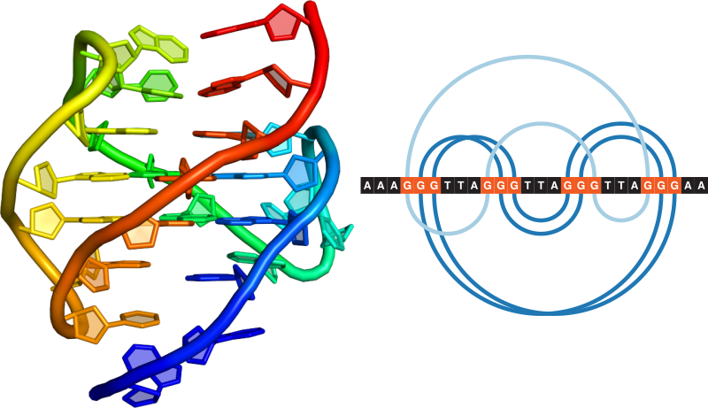
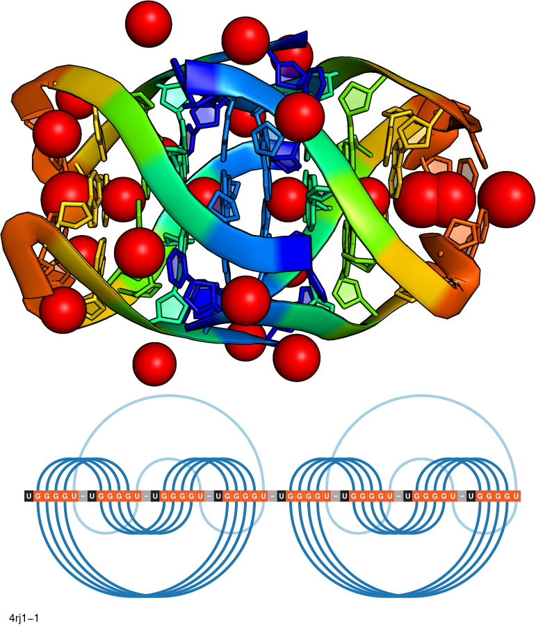

# Project description

This is an application to analyze base pairing patterns of DNA/RNA 3D
structures to find and classify tetrads and quadruplexes. ElTetrado
assigns tetrads to one of the ONZ classes (O, N, Z) alongside with the
directionality of the tetrad (+/-) determined by the bonds between bases
and their non-canonical interactions. The interactions follow
Leontis/Westhof classification (Leontis *et al.* 2001). Watson-Crick (W)
edge of first base in the tetrad structure exposed to the Hoogsteen (H)
edge of the next nucleobase from the same tetrad sets the tetrad
directionality, clockwise (+) or anticlockwise (-). For more details,
please refer to Zok *et al.* (2020) and Popenda *et al.* (2020)

# Installation

Please run:

    pip install eltetrado

If you have both Python 2 and Python 3 installed, you need to explicitly
call `pip3`:

    pip3 install eltetrado

# Dependencies

The project is written in Python 3.6+ and requires
[mmcif](https://pypi.org/project/mmcif/),
[orjson](https://github.com/ijl/orjson), [NumPy](https://numpy.org/) and
[requests](https://docs.python-requests.org/en/latest/).

Visualization is created by `R` 3.6+ script which uses
[R4RNA](https://www.e-rna.org/r-chie/) (Lai *et al.* 2012) library. The
dependency will be automatically installed if not present.

Base pairs and stacking interactions are identified by
[RNApolis](https://github.com/tzok/rnapolis-py).

# Usage

ElTetrado is a command line application, which requires to be provided
with `--input` and a path to a PDB or PDBx/mmCIF file.

By default, ElTetrado outputs textual results on the standard output. A
JSON version of the output can be obtained with `--output` switch
followed by a path where the file is supposed to be created.

ElTetrado prepares visualization of the whole structure and of each
N4-helices, quadruplexes and tetrads. This can be supplemented with
canonical base pairs visualization when `--complete-2d` is set. All
color settings are located in the first several lines of the `quadraw.R`
file, you can easily change them without knowledge of R language. If you
want ElTetrado to not visualize anything, pass `--no-image` switch to
it.

    usage: eltetrado [-h] [-i INPUT] [-o OUTPUT] [-m MODEL]
                     [--stacking-mismatch STACKING_MISMATCH] [--strict]
                     [--no-reorder] [--complete-2d] [--no-image]
                     [--dssr-json DSSR_JSON] [-v]

    options:
      -h, --help            show this help message and exit
      -i INPUT, --input INPUT
                            path to input PDB or PDBx/mmCIF file
      -o OUTPUT, --output OUTPUT
                            (optional) path for output JSON file
      -m MODEL, --model MODEL
                            (optional) model number to process
      --stacking-mismatch STACKING_MISMATCH
                            a perfect tetrad stacking covers 4 nucleotides; this
                            option can be used with value 1 or 2 to allow this
                            number of nucleotides to be non-stacked with otherwise
                            well aligned tetrad [default=2]
      --strict              nucleotides in tetrad are found when linked only by
                            cWH pairing
      --no-reorder          chains of bi- and tetramolecular quadruplexes should
                            be reordered to be able to have them classified; when
                            this is set, chains will be processed in original
                            order, which for bi-/tetramolecular means that they
                            will likely be misclassified; use with care!
      --complete-2d         when set, the visualization will also show canonical
                            base pairs to provide context for the quadruplex
      --no-image            when set, the visualization will not be created at all
      --dssr-json DSSR_JSON
                            (optional) provide a JSON file generated by DSSR to
                            read the secondary structure information from (use
                            --nmr and --json switches)
      -v, --version         show program's version number and exit

# Chains reorder

ElTetrado keeps a global and unique 5’-3’ index for every nucleotide
which is independent from residue numbers. For example, if a structure
has chain M with 60 nucleotides and chain N with 15 nucleotides, then
ElTetrado will keep index between 0 and 74 which uniquely identifies
every nucleotide. Initially, ElTetrado assigns this indices according to
the order of chains in the input file. Therefore, if M preceded N then
nucleotides in M will be indexed from 0 to 59 and in N from 60 to 74.
Otherwise, nucleotides in N will be indexed from 0 to 14 and in M from
15 to 74.

When `--no-reorder` is present, this initial assignment is used.
Otherwise, ElTetrado exhaustively checks all permutations of chains’
orders. Every permutation check induces recalculation of the global and
unique 5’-3’ index and in effect it changes ONZ classification of
tetrads.

ElTetrado keeps a table of tetrad classification scores according to
these rules:

- Type preference: `O` \> `N` \> `Z`
- Direction preference: `+` \> `-`

The table keeps low values for preferred classes i.e. `O+` is 0, `O-` is
1 and so on up to `Z-` with score 5. For every permutation of chain
orders, ElTetrado computes sum of scores for tetrads classification
induced by 5’-3’ indexing. We select permutation with the minimum value.

# Examples

## 2HY9: Human telomere DNA quadruplex structure in K+ solution hybrid-1 form



    $ curl ftp://ftp.wwpdb.org/pub/pdb/data/structures/divided/mmCIF/my/2hy9.cif.gz | gzip -d > 2hy9.cif
    $ ./eltetrado --input 2hy9.cif --output 2hy9.json

    Chain order: 1
    n4-helix with 3 tetrads
      Oh* V,VI 9a -(pll) quadruplex with 3 tetrads
        1.DG4 1.DG22 1.DG18 1.DG10 cWH cWH cWH cWH O- Vb planarity=0.17  
          direction=hybrid rise=3.21 twist=16.23
        1.DG5 1.DG23 1.DG17 1.DG11 cHW cHW cHW cHW O+ Va planarity=0.1  
          direction=hybrid rise=3.11 twist=27.45
        1.DG6 1.DG24 1.DG16 1.DG12 cHW cHW cHW cHW O+ VIa planarity=0.18  

        Tracts:
          1.DG4, 1.DG5, 1.DG6
          1.DG22, 1.DG23, 1.DG24
          1.DG18, 1.DG17, 1.DG16
          1.DG10, 1.DG11, 1.DG12

        Loops:
          propeller- 1.DT7, 1.DT8, 1.DA9
          lateral- 1.DT13, 1.DT14, 1.DA15
          lateral+ 1.DT19, 1.DT20, 1.DA21

    AAAGGGTTAGGGTTAGGGTTAGGGAA
    ...([{...(((...)))...)]}..
    ...([{...)]}...(((...)))..

<details>
<summary>
Click to see the output JSON
</summary>

``` json
{
  "metals": [],
  "nucleotides": [
    {
      "index": 1,
      "chain": "1",
      "number": 1,
      "icode": null,
      "molecule": "DNA",
      "fullName": "1.DA1",
      "shortName": "A",
      "chi": 22.308282830857802,
      "glycosidicBond": "syn"
    },
    {
      "index": 2,
      "chain": "1",
      "number": 2,
      "icode": null,
      "molecule": "DNA",
      "fullName": "1.DA2",
      "shortName": "A",
      "chi": -123.05454402191421,
      "glycosidicBond": "anti"
    },
    {
      "index": 3,
      "chain": "1",
      "number": 3,
      "icode": null,
      "molecule": "DNA",
      "fullName": "1.DA3",
      "shortName": "A",
      "chi": -94.96579955603106,
      "glycosidicBond": "anti"
    },
    {
      "index": 4,
      "chain": "1",
      "number": 4,
      "icode": null,
      "molecule": "DNA",
      "fullName": "1.DG4",
      "shortName": "G",
      "chi": 79.28363721639316,
      "glycosidicBond": "syn"
    },
    {
      "index": 5,
      "chain": "1",
      "number": 5,
      "icode": null,
      "molecule": "DNA",
      "fullName": "1.DG5",
      "shortName": "G",
      "chi": -126.01709201555563,
      "glycosidicBond": "anti"
    },
    {
      "index": 6,
      "chain": "1",
      "number": 6,
      "icode": null,
      "molecule": "DNA",
      "fullName": "1.DG6",
      "shortName": "G",
      "chi": -127.26656202302102,
      "glycosidicBond": "anti"
    },
    {
      "index": 7,
      "chain": "1",
      "number": 7,
      "icode": null,
      "molecule": "DNA",
      "fullName": "1.DT7",
      "shortName": "T",
      "chi": -63.10830751967371,
      "glycosidicBond": "syn"
    },
    {
      "index": 8,
      "chain": "1",
      "number": 8,
      "icode": null,
      "molecule": "DNA",
      "fullName": "1.DT8",
      "shortName": "T",
      "chi": -138.79520345559828,
      "glycosidicBond": "anti"
    },
    {
      "index": 9,
      "chain": "1",
      "number": 9,
      "icode": null,
      "molecule": "DNA",
      "fullName": "1.DA9",
      "shortName": "A",
      "chi": -148.83990757408878,
      "glycosidicBond": "anti"
    },
    {
      "index": 10,
      "chain": "1",
      "number": 10,
      "icode": null,
      "molecule": "DNA",
      "fullName": "1.DG10",
      "shortName": "G",
      "chi": 58.7787525019158,
      "glycosidicBond": "syn"
    },
    {
      "index": 11,
      "chain": "1",
      "number": 11,
      "icode": null,
      "molecule": "DNA",
      "fullName": "1.DG11",
      "shortName": "G",
      "chi": -123.85746807924986,
      "glycosidicBond": "anti"
    },
    {
      "index": 12,
      "chain": "1",
      "number": 12,
      "icode": null,
      "molecule": "DNA",
      "fullName": "1.DG12",
      "shortName": "G",
      "chi": -84.36679807284759,
      "glycosidicBond": "syn"
    },
    {
      "index": 13,
      "chain": "1",
      "number": 13,
      "icode": null,
      "molecule": "DNA",
      "fullName": "1.DT13",
      "shortName": "T",
      "chi": -30.819029132834157,
      "glycosidicBond": "syn"
    },
    {
      "index": 14,
      "chain": "1",
      "number": 14,
      "icode": null,
      "molecule": "DNA",
      "fullName": "1.DT14",
      "shortName": "T",
      "chi": -168.51776782812965,
      "glycosidicBond": "anti"
    },
    {
      "index": 15,
      "chain": "1",
      "number": 15,
      "icode": null,
      "molecule": "DNA",
      "fullName": "1.DA15",
      "shortName": "A",
      "chi": -105.72881577106517,
      "glycosidicBond": "anti"
    },
    {
      "index": 16,
      "chain": "1",
      "number": 16,
      "icode": null,
      "molecule": "DNA",
      "fullName": "1.DG16",
      "shortName": "G",
      "chi": 74.3227942181243,
      "glycosidicBond": "syn"
    },
    {
      "index": 17,
      "chain": "1",
      "number": 17,
      "icode": null,
      "molecule": "DNA",
      "fullName": "1.DG17",
      "shortName": "G",
      "chi": 81.08424926936044,
      "glycosidicBond": "syn"
    },
    {
      "index": 18,
      "chain": "1",
      "number": 18,
      "icode": null,
      "molecule": "DNA",
      "fullName": "1.DG18",
      "shortName": "G",
      "chi": -122.90397217111551,
      "glycosidicBond": "anti"
    },
    {
      "index": 19,
      "chain": "1",
      "number": 19,
      "icode": null,
      "molecule": "DNA",
      "fullName": "1.DT19",
      "shortName": "T",
      "chi": -102.98239337113938,
      "glycosidicBond": "anti"
    },
    {
      "index": 20,
      "chain": "1",
      "number": 20,
      "icode": null,
      "molecule": "DNA",
      "fullName": "1.DT20",
      "shortName": "T",
      "chi": -112.1514601849715,
      "glycosidicBond": "anti"
    },
    {
      "index": 21,
      "chain": "1",
      "number": 21,
      "icode": null,
      "molecule": "DNA",
      "fullName": "1.DA21",
      "shortName": "A",
      "chi": -89.07113063649612,
      "glycosidicBond": "syn"
    },
    {
      "index": 22,
      "chain": "1",
      "number": 22,
      "icode": null,
      "molecule": "DNA",
      "fullName": "1.DG22",
      "shortName": "G",
      "chi": 83.44318693001902,
      "glycosidicBond": "syn"
    },
    {
      "index": 23,
      "chain": "1",
      "number": 23,
      "icode": null,
      "molecule": "DNA",
      "fullName": "1.DG23",
      "shortName": "G",
      "chi": -115.41210237198398,
      "glycosidicBond": "anti"
    },
    {
      "index": 24,
      "chain": "1",
      "number": 24,
      "icode": null,
      "molecule": "DNA",
      "fullName": "1.DG24",
      "shortName": "G",
      "chi": -111.14845782593531,
      "glycosidicBond": "anti"
    },
    {
      "index": 25,
      "chain": "1",
      "number": 25,
      "icode": null,
      "molecule": "DNA",
      "fullName": "1.DA25",
      "shortName": "A",
      "chi": -58.323530637551954,
      "glycosidicBond": "syn"
    },
    {
      "index": 26,
      "chain": "1",
      "number": 26,
      "icode": null,
      "molecule": "DNA",
      "fullName": "1.DA26",
      "shortName": "A",
      "chi": -90.84065243137135,
      "glycosidicBond": "anti"
    }
  ],
  "basePairs": [
    {
      "nt1": "1.DA3",
      "nt2": "1.DA21",
      "lw": "cHW",
      "inTetrad": false,
      "canonical": false
    },
    {
      "nt1": "1.DG4",
      "nt2": "1.DG10",
      "lw": "cHW",
      "inTetrad": true,
      "canonical": false
    },
    {
      "nt1": "1.DG4",
      "nt2": "1.DG22",
      "lw": "cWH",
      "inTetrad": true,
      "canonical": false
    },
    {
      "nt1": "1.DG5",
      "nt2": "1.DG11",
      "lw": "cWH",
      "inTetrad": true,
      "canonical": false
    },
    {
      "nt1": "1.DG5",
      "nt2": "1.DG23",
      "lw": "cHW",
      "inTetrad": true,
      "canonical": false
    },
    {
      "nt1": "1.DG6",
      "nt2": "1.DG12",
      "lw": "cWH",
      "inTetrad": true,
      "canonical": false
    },
    {
      "nt1": "1.DG6",
      "nt2": "1.DG24",
      "lw": "cHW",
      "inTetrad": true,
      "canonical": false
    },
    {
      "nt1": "1.DG10",
      "nt2": "1.DG18",
      "lw": "cHW",
      "inTetrad": true,
      "canonical": false
    },
    {
      "nt1": "1.DG11",
      "nt2": "1.DG17",
      "lw": "cWH",
      "inTetrad": true,
      "canonical": false
    },
    {
      "nt1": "1.DG12",
      "nt2": "1.DG16",
      "lw": "cWH",
      "inTetrad": true,
      "canonical": false
    },
    {
      "nt1": "1.DT14",
      "nt2": "1.DA25",
      "lw": "tWW",
      "inTetrad": false,
      "canonical": false
    },
    {
      "nt1": "1.DG16",
      "nt2": "1.DG24",
      "lw": "cWH",
      "inTetrad": true,
      "canonical": false
    },
    {
      "nt1": "1.DG17",
      "nt2": "1.DG23",
      "lw": "cWH",
      "inTetrad": true,
      "canonical": false
    },
    {
      "nt1": "1.DG18",
      "nt2": "1.DG22",
      "lw": "cHW",
      "inTetrad": true,
      "canonical": false
    }
  ],
  "helices": [
    {
      "quadruplexes": [
        {
          "tetrads": [
            {
              "id": "1.DG4-1.DG22-1.DG18-1.DG10",
              "nt1": "1.DG4",
              "nt2": "1.DG22",
              "nt3": "1.DG18",
              "nt4": "1.DG10",
              "onz": "O-",
              "gbaClassification": "Vb",
              "planarityDeviation": 0.17372283960377805,
              "ionsChannel": [],
              "ionsOutside": []
            },
            {
              "id": "1.DG5-1.DG23-1.DG17-1.DG11",
              "nt1": "1.DG5",
              "nt2": "1.DG23",
              "nt3": "1.DG17",
              "nt4": "1.DG11",
              "onz": "O+",
              "gbaClassification": "Va",
              "planarityDeviation": 0.10474313820007483,
              "ionsChannel": [],
              "ionsOutside": []
            },
            {
              "id": "1.DG6-1.DG24-1.DG16-1.DG12",
              "nt1": "1.DG6",
              "nt2": "1.DG24",
              "nt3": "1.DG16",
              "nt4": "1.DG12",
              "onz": "O+",
              "gbaClassification": "VIa",
              "planarityDeviation": 0.18293509778060615,
              "ionsChannel": [],
              "ionsOutside": []
            }
          ],
          "onzm": "Oh*",
          "loopClassification": {
            "classification": "9a",
            "loopProgression": "-(pll)"
          },
          "gbaClassification": [
            "V",
            "VI"
          ],
          "tracts": [
            [
              "1.DG4",
              "1.DG5",
              "1.DG6"
            ],
            [
              "1.DG22",
              "1.DG23",
              "1.DG24"
            ],
            [
              "1.DG18",
              "1.DG17",
              "1.DG16"
            ],
            [
              "1.DG10",
              "1.DG11",
              "1.DG12"
            ]
          ],
          "loops": [
            {
              "type": "propeller-",
              "nucleotides": [
                "1.DT7",
                "1.DT8",
                "1.DA9"
              ]
            },
            {
              "type": "lateral-",
              "nucleotides": [
                "1.DT13",
                "1.DT14",
                "1.DA15"
              ]
            },
            {
              "type": "lateral+",
              "nucleotides": [
                "1.DT19",
                "1.DT20",
                "1.DA21"
              ]
            }
          ]
        }
      ],
      "tetradPairs": [
        {
          "tetrad1": "1.DG4-1.DG22-1.DG18-1.DG10",
          "tetrad2": "1.DG5-1.DG23-1.DG17-1.DG11",
          "direction": "hybrid",
          "rise": 3.2109650905140654,
          "twist": 16.228973729066034
        },
        {
          "tetrad1": "1.DG5-1.DG23-1.DG17-1.DG11",
          "tetrad2": "1.DG6-1.DG24-1.DG16-1.DG12",
          "direction": "hybrid",
          "rise": 3.1149939255558747,
          "twist": 27.448958336697046
        }
      ]
    }
  ],
  "dotBracket": {
    "sequence": "AAAGGGTTAGGGTTAGGGTTAGGGAA",
    "line1": "...([{...(((...)))...)]}..",
    "line2": "...([{...)]}...(((...))).."
  }
}
```

</details>

## 4RJ1: Structural variations and solvent structure of UGGGGU quadruplexes stabilized by Sr2+ ions



    $ curl https://www.ebi.ac.uk/pdbe/static/entry/download/4rj1-assembly-1.cif.gz | gzip -d > 4rj1-1.cif
    $ ./eltetrado --input 4rj1-1.cif --output 4rj1-1.json

    Chain order: A AB AA AC B BC BA BB
    n4-helix with 10 tetrads
      Op* VIII n/a quadruplex with 5 tetrads
        A.U1006 AC.U1006 AA.U1006 AB.U1006 cWH cWH cWH cWH O- VIIIa planarity=1.06 ions_channel=NA ions_outside=A.U1006: [SR] AA.U1006: [SR] AB.U1006: [SR] AC.U1006: [SR]
          direction=parallel rise=3.37 twist=39.96
        A.G1005 AC.G1005 AA.G1005 AB.G1005 cHW cHW cHW cHW O+ VIIIa planarity=0.8  
          direction=parallel rise=3.31 twist=25.9
        A.G1004 AC.G1004 AA.G1004 AB.G1004 cHW cHW cHW cHW O+ VIIIa planarity=0.41 ions_channel=SR 
          direction=parallel rise=3.34 twist=35.81
        A.G1003 AC.G1003 AA.G1003 AB.G1003 cHW cHW cHW cHW O+ VIIIa planarity=0.55 ions_channel=SR 
          direction=parallel rise=3.29 twist=27.12
        A.G1002 AC.G1002 AA.G1002 AB.G1002 cHW cHW cHW cHW O+ VIIIa planarity=0.54  ions_outside=AB.G1002: [CA] AC.G1002: [CA] AA.G1002: [CA] A.G1002: [CA]

        Tracts:
          A.U1006, A.G1005, A.G1004, A.G1003, A.G1002
          AC.U1006, AC.G1005, AC.G1004, AC.G1003, AC.G1002
          AA.U1006, AA.G1005, AA.G1004, AA.G1003, AA.G1002
          AB.U1006, AB.G1005, AB.G1004, AB.G1003, AB.G1002

      Op* VIII n/a quadruplex with 5 tetrads
        B.G2002 BC.G2002 BA.G2002 BB.G2002 cWH cWH cWH cWH O+ VIIIa planarity=0.67  
          direction=parallel rise=3.37 twist=27.41
        B.G2003 BC.G2003 BA.G2003 BB.G2003 cWH cWH cWH cWH O+ VIIIa planarity=0.58 ions_channel=SR ions_outside=B.G2003: [CA] BA.G2003: [CA] BB.G2003: [CA] BC.G2003: [CA]
          direction=parallel rise=3.32 twist=35.04
        B.G2004 BC.G2004 BA.G2004 BB.G2004 cWH cWH cWH cWH O+ VIIIa planarity=0.23 ions_channel=SR 
          direction=parallel rise=3.27 twist=25.15
        B.G2005 BC.G2005 BA.G2005 BB.G2005 cWH cWH cWH cWH O+ VIIIa planarity=0.78 ions_channel=NA 
          direction=parallel rise=7.14 twist=43.41
        B.U2006 BC.U2006 BA.U2006 BB.U2006 cHW cHW cHW cHW O- VIIIa planarity=1.58 ions_channel=NA,NA 

        Tracts:
          B.G2002, B.G2003, B.G2004, B.G2005, B.U2006
          BC.G2002, BC.G2003, BC.G2004, BC.G2005, BC.U2006
          BA.G2002, BA.G2003, BA.G2004, BA.G2005, BA.U2006
          BB.G2002, BB.G2003, BB.G2004, BB.G2005, BB.U2006

    UGGGGU-UGGGGU-UGGGGU-UGGGGU-UGGGGU-UGGGGU-UGGGGU-UGGGGU
    .([{<A-.([{<A-.)]}>a-.)]}>a-.([{<A-.)]}>a-.([{<A-.)]}>a
    .([{<A-.)]}>a-.([{<A-.)]}>a-.([{<A-.([{<A-.)]}>a-.)]}>a

<details>
<summary>
Click to see the output JSON
</summary>

``` json
{
  "metals": [
    {
      "symbol": "Sr",
      "count": 8
    },
    {
      "symbol": "Na",
      "count": 4
    },
    {
      "symbol": "Ca",
      "count": 12
    }
  ],
  "nucleotides": [
    {
      "index": 1,
      "chain": "A",
      "number": 1001,
      "icode": null,
      "molecule": "RNA",
      "fullName": "A.U1001",
      "shortName": "U",
      "chi": -141.92671313255752,
      "glycosidicBond": "anti"
    },
    {
      "index": 2,
      "chain": "A",
      "number": 1002,
      "icode": null,
      "molecule": "RNA",
      "fullName": "A.G1002",
      "shortName": "G",
      "chi": -165.93034671112116,
      "glycosidicBond": "anti"
    },
    {
      "index": 3,
      "chain": "A",
      "number": 1003,
      "icode": null,
      "molecule": "RNA",
      "fullName": "A.G1003",
      "shortName": "G",
      "chi": -121.5652426033226,
      "glycosidicBond": "anti"
    },
    {
      "index": 4,
      "chain": "A",
      "number": 1004,
      "icode": null,
      "molecule": "RNA",
      "fullName": "A.G1004",
      "shortName": "G",
      "chi": -156.00957673923344,
      "glycosidicBond": "anti"
    },
    {
      "index": 5,
      "chain": "A",
      "number": 1005,
      "icode": null,
      "molecule": "RNA",
      "fullName": "A.G1005",
      "shortName": "G",
      "chi": -148.10051684016415,
      "glycosidicBond": "anti"
    },
    {
      "index": 6,
      "chain": "A",
      "number": 1006,
      "icode": null,
      "molecule": "RNA",
      "fullName": "A.U1006",
      "shortName": "U",
      "chi": -137.28005568139983,
      "glycosidicBond": "anti"
    },
    {
      "index": 13,
      "chain": "AA",
      "number": 1001,
      "icode": null,
      "molecule": "RNA",
      "fullName": "AA.U1001",
      "shortName": "U",
      "chi": -141.9267131325575,
      "glycosidicBond": "anti"
    },
    {
      "index": 14,
      "chain": "AA",
      "number": 1002,
      "icode": null,
      "molecule": "RNA",
      "fullName": "AA.G1002",
      "shortName": "G",
      "chi": -165.93034671112113,
      "glycosidicBond": "anti"
    },
    {
      "index": 15,
      "chain": "AA",
      "number": 1003,
      "icode": null,
      "molecule": "RNA",
      "fullName": "AA.G1003",
      "shortName": "G",
      "chi": -121.56524260332266,
      "glycosidicBond": "anti"
    },
    {
      "index": 16,
      "chain": "AA",
      "number": 1004,
      "icode": null,
      "molecule": "RNA",
      "fullName": "AA.G1004",
      "shortName": "G",
      "chi": -156.0095767392335,
      "glycosidicBond": "anti"
    },
    {
      "index": 17,
      "chain": "AA",
      "number": 1005,
      "icode": null,
      "molecule": "RNA",
      "fullName": "AA.G1005",
      "shortName": "G",
      "chi": -148.10051684016406,
      "glycosidicBond": "anti"
    },
    {
      "index": 18,
      "chain": "AA",
      "number": 1006,
      "icode": null,
      "molecule": "RNA",
      "fullName": "AA.U1006",
      "shortName": "U",
      "chi": -137.2800556813998,
      "glycosidicBond": "anti"
    },
    {
      "index": 7,
      "chain": "AB",
      "number": 1001,
      "icode": null,
      "molecule": "RNA",
      "fullName": "AB.U1001",
      "shortName": "U",
      "chi": -141.9267131325574,
      "glycosidicBond": "anti"
    },
    {
      "index": 8,
      "chain": "AB",
      "number": 1002,
      "icode": null,
      "molecule": "RNA",
      "fullName": "AB.G1002",
      "shortName": "G",
      "chi": -165.93034671112113,
      "glycosidicBond": "anti"
    },
    {
      "index": 9,
      "chain": "AB",
      "number": 1003,
      "icode": null,
      "molecule": "RNA",
      "fullName": "AB.G1003",
      "shortName": "G",
      "chi": -121.56524260332266,
      "glycosidicBond": "anti"
    },
    {
      "index": 10,
      "chain": "AB",
      "number": 1004,
      "icode": null,
      "molecule": "RNA",
      "fullName": "AB.G1004",
      "shortName": "G",
      "chi": -156.00957673923347,
      "glycosidicBond": "anti"
    },
    {
      "index": 11,
      "chain": "AB",
      "number": 1005,
      "icode": null,
      "molecule": "RNA",
      "fullName": "AB.G1005",
      "shortName": "G",
      "chi": -148.10051684016406,
      "glycosidicBond": "anti"
    },
    {
      "index": 12,
      "chain": "AB",
      "number": 1006,
      "icode": null,
      "molecule": "RNA",
      "fullName": "AB.U1006",
      "shortName": "U",
      "chi": -137.28005568139977,
      "glycosidicBond": "anti"
    },
    {
      "index": 19,
      "chain": "AC",
      "number": 1001,
      "icode": null,
      "molecule": "RNA",
      "fullName": "AC.U1001",
      "shortName": "U",
      "chi": -141.92671313255747,
      "glycosidicBond": "anti"
    },
    {
      "index": 20,
      "chain": "AC",
      "number": 1002,
      "icode": null,
      "molecule": "RNA",
      "fullName": "AC.G1002",
      "shortName": "G",
      "chi": -165.93034671112116,
      "glycosidicBond": "anti"
    },
    {
      "index": 21,
      "chain": "AC",
      "number": 1003,
      "icode": null,
      "molecule": "RNA",
      "fullName": "AC.G1003",
      "shortName": "G",
      "chi": -121.56524260332266,
      "glycosidicBond": "anti"
    },
    {
      "index": 22,
      "chain": "AC",
      "number": 1004,
      "icode": null,
      "molecule": "RNA",
      "fullName": "AC.G1004",
      "shortName": "G",
      "chi": -156.00957673923352,
      "glycosidicBond": "anti"
    },
    {
      "index": 23,
      "chain": "AC",
      "number": 1005,
      "icode": null,
      "molecule": "RNA",
      "fullName": "AC.G1005",
      "shortName": "G",
      "chi": -148.1005168401641,
      "glycosidicBond": "anti"
    },
    {
      "index": 24,
      "chain": "AC",
      "number": 1006,
      "icode": null,
      "molecule": "RNA",
      "fullName": "AC.U1006",
      "shortName": "U",
      "chi": -137.28005568139986,
      "glycosidicBond": "anti"
    },
    {
      "index": 25,
      "chain": "B",
      "number": 2001,
      "icode": null,
      "molecule": "RNA",
      "fullName": "B.U2001",
      "shortName": "U",
      "chi": -146.4615316869476,
      "glycosidicBond": "anti"
    },
    {
      "index": 26,
      "chain": "B",
      "number": 2002,
      "icode": null,
      "molecule": "RNA",
      "fullName": "B.G2002",
      "shortName": "G",
      "chi": -170.79660912745996,
      "glycosidicBond": "anti"
    },
    {
      "index": 27,
      "chain": "B",
      "number": 2003,
      "icode": null,
      "molecule": "RNA",
      "fullName": "B.G2003",
      "shortName": "G",
      "chi": -117.68718110874113,
      "glycosidicBond": "anti"
    },
    {
      "index": 28,
      "chain": "B",
      "number": 2004,
      "icode": null,
      "molecule": "RNA",
      "fullName": "B.G2004",
      "shortName": "G",
      "chi": -153.88587375071324,
      "glycosidicBond": "anti"
    },
    {
      "index": 29,
      "chain": "B",
      "number": 2005,
      "icode": null,
      "molecule": "RNA",
      "fullName": "B.G2005",
      "shortName": "G",
      "chi": -148.8519912845669,
      "glycosidicBond": "anti"
    },
    {
      "index": 30,
      "chain": "B",
      "number": 2006,
      "icode": null,
      "molecule": "RNA",
      "fullName": "B.U2006",
      "shortName": "U",
      "chi": -159.43730655241544,
      "glycosidicBond": "anti"
    },
    {
      "index": 37,
      "chain": "BA",
      "number": 2001,
      "icode": null,
      "molecule": "RNA",
      "fullName": "BA.U2001",
      "shortName": "U",
      "chi": -146.46153168694764,
      "glycosidicBond": "anti"
    },
    {
      "index": 38,
      "chain": "BA",
      "number": 2002,
      "icode": null,
      "molecule": "RNA",
      "fullName": "BA.G2002",
      "shortName": "G",
      "chi": -170.79660912745993,
      "glycosidicBond": "anti"
    },
    {
      "index": 39,
      "chain": "BA",
      "number": 2003,
      "icode": null,
      "molecule": "RNA",
      "fullName": "BA.G2003",
      "shortName": "G",
      "chi": -117.68718110874113,
      "glycosidicBond": "anti"
    },
    {
      "index": 40,
      "chain": "BA",
      "number": 2004,
      "icode": null,
      "molecule": "RNA",
      "fullName": "BA.G2004",
      "shortName": "G",
      "chi": -153.88587375071322,
      "glycosidicBond": "anti"
    },
    {
      "index": 41,
      "chain": "BA",
      "number": 2005,
      "icode": null,
      "molecule": "RNA",
      "fullName": "BA.G2005",
      "shortName": "G",
      "chi": -148.851991284567,
      "glycosidicBond": "anti"
    },
    {
      "index": 42,
      "chain": "BA",
      "number": 2006,
      "icode": null,
      "molecule": "RNA",
      "fullName": "BA.U2006",
      "shortName": "U",
      "chi": -159.43730655241544,
      "glycosidicBond": "anti"
    },
    {
      "index": 43,
      "chain": "BB",
      "number": 2001,
      "icode": null,
      "molecule": "RNA",
      "fullName": "BB.U2001",
      "shortName": "U",
      "chi": -146.4615316869476,
      "glycosidicBond": "anti"
    },
    {
      "index": 44,
      "chain": "BB",
      "number": 2002,
      "icode": null,
      "molecule": "RNA",
      "fullName": "BB.G2002",
      "shortName": "G",
      "chi": -170.79660912745993,
      "glycosidicBond": "anti"
    },
    {
      "index": 45,
      "chain": "BB",
      "number": 2003,
      "icode": null,
      "molecule": "RNA",
      "fullName": "BB.G2003",
      "shortName": "G",
      "chi": -117.68718110874106,
      "glycosidicBond": "anti"
    },
    {
      "index": 46,
      "chain": "BB",
      "number": 2004,
      "icode": null,
      "molecule": "RNA",
      "fullName": "BB.G2004",
      "shortName": "G",
      "chi": -153.8858737507132,
      "glycosidicBond": "anti"
    },
    {
      "index": 47,
      "chain": "BB",
      "number": 2005,
      "icode": null,
      "molecule": "RNA",
      "fullName": "BB.G2005",
      "shortName": "G",
      "chi": -148.85199128456696,
      "glycosidicBond": "anti"
    },
    {
      "index": 48,
      "chain": "BB",
      "number": 2006,
      "icode": null,
      "molecule": "RNA",
      "fullName": "BB.U2006",
      "shortName": "U",
      "chi": -159.43730655241544,
      "glycosidicBond": "anti"
    },
    {
      "index": 31,
      "chain": "BC",
      "number": 2001,
      "icode": null,
      "molecule": "RNA",
      "fullName": "BC.U2001",
      "shortName": "U",
      "chi": -146.4615316869476,
      "glycosidicBond": "anti"
    },
    {
      "index": 32,
      "chain": "BC",
      "number": 2002,
      "icode": null,
      "molecule": "RNA",
      "fullName": "BC.G2002",
      "shortName": "G",
      "chi": -170.79660912745993,
      "glycosidicBond": "anti"
    },
    {
      "index": 33,
      "chain": "BC",
      "number": 2003,
      "icode": null,
      "molecule": "RNA",
      "fullName": "BC.G2003",
      "shortName": "G",
      "chi": -117.68718110874121,
      "glycosidicBond": "anti"
    },
    {
      "index": 34,
      "chain": "BC",
      "number": 2004,
      "icode": null,
      "molecule": "RNA",
      "fullName": "BC.G2004",
      "shortName": "G",
      "chi": -153.88587375071322,
      "glycosidicBond": "anti"
    },
    {
      "index": 35,
      "chain": "BC",
      "number": 2005,
      "icode": null,
      "molecule": "RNA",
      "fullName": "BC.G2005",
      "shortName": "G",
      "chi": -148.85199128456694,
      "glycosidicBond": "anti"
    },
    {
      "index": 36,
      "chain": "BC",
      "number": 2006,
      "icode": null,
      "molecule": "RNA",
      "fullName": "BC.U2006",
      "shortName": "U",
      "chi": -159.43730655241544,
      "glycosidicBond": "anti"
    }
  ],
  "basePairs": [
    {
      "nt1": "A.G1002",
      "nt2": "AB.G1002",
      "lw": "cWH",
      "inTetrad": true,
      "canonical": false
    },
    {
      "nt1": "A.G1002",
      "nt2": "AC.G1002",
      "lw": "cHW",
      "inTetrad": true,
      "canonical": false
    },
    {
      "nt1": "A.G1003",
      "nt2": "AB.G1003",
      "lw": "cWH",
      "inTetrad": true,
      "canonical": false
    },
    {
      "nt1": "A.G1003",
      "nt2": "AC.G1003",
      "lw": "cHW",
      "inTetrad": true,
      "canonical": false
    },
    {
      "nt1": "A.G1004",
      "nt2": "AB.G1004",
      "lw": "cWH",
      "inTetrad": true,
      "canonical": false
    },
    {
      "nt1": "A.G1004",
      "nt2": "AC.G1004",
      "lw": "cHW",
      "inTetrad": true,
      "canonical": false
    },
    {
      "nt1": "A.G1005",
      "nt2": "AB.G1005",
      "lw": "cWH",
      "inTetrad": true,
      "canonical": false
    },
    {
      "nt1": "A.G1005",
      "nt2": "AC.G1005",
      "lw": "cHW",
      "inTetrad": true,
      "canonical": false
    },
    {
      "nt1": "A.U1006",
      "nt2": "AB.U1006",
      "lw": "cHW",
      "inTetrad": true,
      "canonical": false
    },
    {
      "nt1": "A.U1006",
      "nt2": "AC.U1006",
      "lw": "cWH",
      "inTetrad": true,
      "canonical": false
    },
    {
      "nt1": "AB.G1002",
      "nt2": "AA.G1002",
      "lw": "cWH",
      "inTetrad": true,
      "canonical": false
    },
    {
      "nt1": "AA.G1002",
      "nt2": "AC.G1002",
      "lw": "cWH",
      "inTetrad": true,
      "canonical": false
    },
    {
      "nt1": "AB.G1003",
      "nt2": "AA.G1003",
      "lw": "cWH",
      "inTetrad": true,
      "canonical": false
    },
    {
      "nt1": "AA.G1003",
      "nt2": "AC.G1003",
      "lw": "cWH",
      "inTetrad": true,
      "canonical": false
    },
    {
      "nt1": "AB.G1004",
      "nt2": "AA.G1004",
      "lw": "cWH",
      "inTetrad": true,
      "canonical": false
    },
    {
      "nt1": "AA.G1004",
      "nt2": "AC.G1004",
      "lw": "cWH",
      "inTetrad": true,
      "canonical": false
    },
    {
      "nt1": "AB.G1005",
      "nt2": "AA.G1005",
      "lw": "cWH",
      "inTetrad": true,
      "canonical": false
    },
    {
      "nt1": "AA.G1005",
      "nt2": "AC.G1005",
      "lw": "cWH",
      "inTetrad": true,
      "canonical": false
    },
    {
      "nt1": "AB.U1006",
      "nt2": "AA.U1006",
      "lw": "cHW",
      "inTetrad": true,
      "canonical": false
    },
    {
      "nt1": "AA.U1006",
      "nt2": "AC.U1006",
      "lw": "cHW",
      "inTetrad": true,
      "canonical": false
    },
    {
      "nt1": "B.G2002",
      "nt2": "BB.G2002",
      "lw": "cHW",
      "inTetrad": true,
      "canonical": false
    },
    {
      "nt1": "B.G2002",
      "nt2": "BC.G2002",
      "lw": "cWH",
      "inTetrad": true,
      "canonical": false
    },
    {
      "nt1": "B.G2003",
      "nt2": "BB.G2003",
      "lw": "cHW",
      "inTetrad": true,
      "canonical": false
    },
    {
      "nt1": "B.G2003",
      "nt2": "BC.G2003",
      "lw": "cWH",
      "inTetrad": true,
      "canonical": false
    },
    {
      "nt1": "B.G2004",
      "nt2": "BB.G2004",
      "lw": "cHW",
      "inTetrad": true,
      "canonical": false
    },
    {
      "nt1": "B.G2004",
      "nt2": "BC.G2004",
      "lw": "cWH",
      "inTetrad": true,
      "canonical": false
    },
    {
      "nt1": "B.G2005",
      "nt2": "BB.G2005",
      "lw": "cHW",
      "inTetrad": true,
      "canonical": false
    },
    {
      "nt1": "B.G2005",
      "nt2": "BC.G2005",
      "lw": "cWH",
      "inTetrad": true,
      "canonical": false
    },
    {
      "nt1": "B.U2006",
      "nt2": "BB.U2006",
      "lw": "cWH",
      "inTetrad": true,
      "canonical": false
    },
    {
      "nt1": "B.U2006",
      "nt2": "BC.U2006",
      "lw": "cHW",
      "inTetrad": true,
      "canonical": false
    },
    {
      "nt1": "BA.G2002",
      "nt2": "BB.G2002",
      "lw": "cWH",
      "inTetrad": true,
      "canonical": false
    },
    {
      "nt1": "BC.G2002",
      "nt2": "BA.G2002",
      "lw": "cWH",
      "inTetrad": true,
      "canonical": false
    },
    {
      "nt1": "BA.G2003",
      "nt2": "BB.G2003",
      "lw": "cWH",
      "inTetrad": true,
      "canonical": false
    },
    {
      "nt1": "BC.G2003",
      "nt2": "BA.G2003",
      "lw": "cWH",
      "inTetrad": true,
      "canonical": false
    },
    {
      "nt1": "BA.G2004",
      "nt2": "BB.G2004",
      "lw": "cWH",
      "inTetrad": true,
      "canonical": false
    },
    {
      "nt1": "BC.G2004",
      "nt2": "BA.G2004",
      "lw": "cWH",
      "inTetrad": true,
      "canonical": false
    },
    {
      "nt1": "BA.G2005",
      "nt2": "BB.G2005",
      "lw": "cWH",
      "inTetrad": true,
      "canonical": false
    },
    {
      "nt1": "BC.G2005",
      "nt2": "BA.G2005",
      "lw": "cWH",
      "inTetrad": true,
      "canonical": false
    },
    {
      "nt1": "BA.U2006",
      "nt2": "BB.U2006",
      "lw": "cHW",
      "inTetrad": true,
      "canonical": false
    },
    {
      "nt1": "BC.U2006",
      "nt2": "BA.U2006",
      "lw": "cHW",
      "inTetrad": true,
      "canonical": false
    }
  ],
  "helices": [
    {
      "quadruplexes": [
        {
          "tetrads": [
            {
              "id": "A.U1006-AC.U1006-AA.U1006-AB.U1006",
              "nt1": "A.U1006",
              "nt2": "AC.U1006",
              "nt3": "AA.U1006",
              "nt4": "AB.U1006",
              "onz": "O-",
              "gbaClassification": "VIIIa",
              "planarityDeviation": 1.061,
              "ionsChannel": [
                "NA"
              ],
              "ionsOutside": [
                {
                  "nt": "A.U1006",
                  "ion": "SR"
                },
                {
                  "nt": "AA.U1006",
                  "ion": "SR"
                },
                {
                  "nt": "AB.U1006",
                  "ion": "SR"
                },
                {
                  "nt": "AC.U1006",
                  "ion": "SR"
                }
              ]
            },
            {
              "id": "A.G1005-AC.G1005-AA.G1005-AB.G1005",
              "nt1": "A.G1005",
              "nt2": "AC.G1005",
              "nt3": "AA.G1005",
              "nt4": "AB.G1005",
              "onz": "O+",
              "gbaClassification": "VIIIa",
              "planarityDeviation": 0.7999999999999972,
              "ionsChannel": [],
              "ionsOutside": []
            },
            {
              "id": "A.G1004-AC.G1004-AA.G1004-AB.G1004",
              "nt1": "A.G1004",
              "nt2": "AC.G1004",
              "nt3": "AA.G1004",
              "nt4": "AB.G1004",
              "onz": "O+",
              "gbaClassification": "VIIIa",
              "planarityDeviation": 0.4059999999999988,
              "ionsChannel": [
                "SR"
              ],
              "ionsOutside": []
            },
            {
              "id": "A.G1003-AC.G1003-AA.G1003-AB.G1003",
              "nt1": "A.G1003",
              "nt2": "AC.G1003",
              "nt3": "AA.G1003",
              "nt4": "AB.G1003",
              "onz": "O+",
              "gbaClassification": "VIIIa",
              "planarityDeviation": 0.5549999999999997,
              "ionsChannel": [
                "SR"
              ],
              "ionsOutside": []
            },
            {
              "id": "A.G1002-AC.G1002-AA.G1002-AB.G1002",
              "nt1": "A.G1002",
              "nt2": "AC.G1002",
              "nt3": "AA.G1002",
              "nt4": "AB.G1002",
              "onz": "O+",
              "gbaClassification": "VIIIa",
              "planarityDeviation": 0.541999999999998,
              "ionsChannel": [],
              "ionsOutside": [
                {
                  "nt": "AB.G1002",
                  "ion": "CA"
                },
                {
                  "nt": "AC.G1002",
                  "ion": "CA"
                },
                {
                  "nt": "AA.G1002",
                  "ion": "CA"
                },
                {
                  "nt": "A.G1002",
                  "ion": "CA"
                }
              ]
            }
          ],
          "onzm": "Op*",
          "loopClassification": null,
          "gbaClassification": [
            "VIII"
          ],
          "tracts": [
            [
              "A.U1006",
              "A.G1005",
              "A.G1004",
              "A.G1003",
              "A.G1002"
            ],
            [
              "AC.U1006",
              "AC.G1005",
              "AC.G1004",
              "AC.G1003",
              "AC.G1002"
            ],
            [
              "AA.U1006",
              "AA.G1005",
              "AA.G1004",
              "AA.G1003",
              "AA.G1002"
            ],
            [
              "AB.U1006",
              "AB.G1005",
              "AB.G1004",
              "AB.G1003",
              "AB.G1002"
            ]
          ],
          "loops": []
        },
        {
          "tetrads": [
            {
              "id": "B.G2002-BC.G2002-BA.G2002-BB.G2002",
              "nt1": "B.G2002",
              "nt2": "BC.G2002",
              "nt3": "BA.G2002",
              "nt4": "BB.G2002",
              "onz": "O+",
              "gbaClassification": "VIIIa",
              "planarityDeviation": 0.6730000000000018,
              "ionsChannel": [],
              "ionsOutside": []
            },
            {
              "id": "B.G2003-BC.G2003-BA.G2003-BB.G2003",
              "nt1": "B.G2003",
              "nt2": "BC.G2003",
              "nt3": "BA.G2003",
              "nt4": "BB.G2003",
              "onz": "O+",
              "gbaClassification": "VIIIa",
              "planarityDeviation": 0.5769999999999982,
              "ionsChannel": [
                "SR"
              ],
              "ionsOutside": [
                {
                  "nt": "B.G2003",
                  "ion": "CA"
                },
                {
                  "nt": "BA.G2003",
                  "ion": "CA"
                },
                {
                  "nt": "BB.G2003",
                  "ion": "CA"
                },
                {
                  "nt": "BC.G2003",
                  "ion": "CA"
                }
              ]
            },
            {
              "id": "B.G2004-BC.G2004-BA.G2004-BB.G2004",
              "nt1": "B.G2004",
              "nt2": "BC.G2004",
              "nt3": "BA.G2004",
              "nt4": "BB.G2004",
              "onz": "O+",
              "gbaClassification": "VIIIa",
              "planarityDeviation": 0.2289999999999992,
              "ionsChannel": [
                "SR"
              ],
              "ionsOutside": []
            },
            {
              "id": "B.G2005-BC.G2005-BA.G2005-BB.G2005",
              "nt1": "B.G2005",
              "nt2": "BC.G2005",
              "nt3": "BA.G2005",
              "nt4": "BB.G2005",
              "onz": "O+",
              "gbaClassification": "VIIIa",
              "planarityDeviation": 0.7810000000000006,
              "ionsChannel": [
                "NA"
              ],
              "ionsOutside": []
            },
            {
              "id": "B.U2006-BC.U2006-BA.U2006-BB.U2006",
              "nt1": "B.U2006",
              "nt2": "BC.U2006",
              "nt3": "BA.U2006",
              "nt4": "BB.U2006",
              "onz": "O-",
              "gbaClassification": "VIIIa",
              "planarityDeviation": 1.5840000000000005,
              "ionsChannel": [
                "NA",
                "NA"
              ],
              "ionsOutside": []
            }
          ],
          "onzm": "Op*",
          "loopClassification": null,
          "gbaClassification": [
            "VIII"
          ],
          "tracts": [
            [
              "B.G2002",
              "B.G2003",
              "B.G2004",
              "B.G2005",
              "B.U2006"
            ],
            [
              "BC.G2002",
              "BC.G2003",
              "BC.G2004",
              "BC.G2005",
              "BC.U2006"
            ],
            [
              "BA.G2002",
              "BA.G2003",
              "BA.G2004",
              "BA.G2005",
              "BA.U2006"
            ],
            [
              "BB.G2002",
              "BB.G2003",
              "BB.G2004",
              "BB.G2005",
              "BB.U2006"
            ]
          ],
          "loops": []
        }
      ],
      "tetradPairs": [
        {
          "tetrad1": "A.U1006-AC.U1006-AA.U1006-AB.U1006",
          "tetrad2": "A.G1005-AC.G1005-AA.G1005-AB.G1005",
          "direction": "parallel",
          "rise": 3.366499999999995,
          "twist": 39.962531742191736
        },
        {
          "tetrad1": "A.G1005-AC.G1005-AA.G1005-AB.G1005",
          "tetrad2": "A.G1004-AC.G1004-AA.G1004-AB.G1004",
          "direction": "parallel",
          "rise": 3.308000000000007,
          "twist": 25.89614444631925
        },
        {
          "tetrad1": "A.G1004-AC.G1004-AA.G1004-AB.G1004",
          "tetrad2": "A.G1003-AC.G1003-AA.G1003-AB.G1003",
          "direction": "parallel",
          "rise": 3.339499999999994,
          "twist": 35.81115298630443
        },
        {
          "tetrad1": "A.G1003-AC.G1003-AA.G1003-AB.G1003",
          "tetrad2": "A.G1002-AC.G1002-AA.G1002-AB.G1002",
          "direction": "parallel",
          "rise": 3.2865,
          "twist": 27.11515971986803
        },
        {
          "tetrad1": "A.G1002-AC.G1002-AA.G1002-AB.G1002",
          "tetrad2": "B.G2002-BC.G2002-BA.G2002-BB.G2002",
          "direction": "parallel",
          "rise": 3.369500000000002,
          "twist": 28.993180312675573
        },
        {
          "tetrad1": "B.G2002-BC.G2002-BA.G2002-BB.G2002",
          "tetrad2": "B.G2003-BC.G2003-BA.G2003-BB.G2003",
          "direction": "parallel",
          "rise": 3.371000000000002,
          "twist": 27.410084968596852
        },
        {
          "tetrad1": "B.G2003-BC.G2003-BA.G2003-BB.G2003",
          "tetrad2": "B.G2004-BC.G2004-BA.G2004-BB.G2004",
          "direction": "parallel",
          "rise": 3.318000000000005,
          "twist": 35.04072146975963
        },
        {
          "tetrad1": "B.G2004-BC.G2004-BA.G2004-BB.G2004",
          "tetrad2": "B.G2005-BC.G2005-BA.G2005-BB.G2005",
          "direction": "parallel",
          "rise": 3.2689999999999966,
          "twist": 25.149997949938147
        },
        {
          "tetrad1": "B.G2005-BC.G2005-BA.G2005-BB.G2005",
          "tetrad2": "B.U2006-BC.U2006-BA.U2006-BB.U2006",
          "direction": "parallel",
          "rise": 7.140499999999998,
          "twist": 43.40609492262336
        }
      ]
    }
  ],
  "dotBracket": {
    "sequence": "UGGGGU-UGGGGU-UGGGGU-UGGGGU-UGGGGU-UGGGGU-UGGGGU-UGGGGU",
    "line1": ".([{<A-.([{<A-.)]}>a-.)]}>a-.([{<A-.)]}>a-.([{<A-.)]}>a",
    "line2": ".([{<A-.)]}>a-.([{<A-.)]}>a-.([{<A-.([{<A-.)]}>a-.)]}>a"
  }
}
```

</details>

# Funding

This research was supported by the National Science Centre, Poland
\[2016/23/B/ST6/03931, 2019/35/B/ST6/03074\] and Mloda Kadra project
\[09/91/SBAD/0684\] from Poznan University of Technology, and carried
out in the European Centre for Bioinformatics and Genomics (Poland). The
authors also acknowledge partial support by the statutory funds of
Poznan University of Technology, Polish Ministry of Science and Higher
Education, and the Institute of Bioorganic Chemistry, PAS within
intramural financing program.

# Bibliography

<div id="refs" class="references csl-bib-body">

1.  Topology-Based Classification of Tetrads and Quadruplex
    Structures. M. Popenda, J. Miskiewicz, J. Sarzynska, T. Zok, M.
    Szachniuk. *Bioinformatics*. 2020. 36(4):1129–1134.
    doi:[10.1093/bioinformatics/btz738](https://doi.org/10.1093/bioinformatics/btz738)

2.  ElTetrado: A Tool for Identification and Classification of Tetrads
    and Quadruplexes. T. Zok, M. Popenda, M. Szachniuk. *BMC
    Bioinformatics*. 2020. 21(1):40.
    doi:[10.1186/s12859-020-3385-1](https://doi.org/10.1186/s12859-020-3385-1)

3.  R-Chie : A Web Server and R Package for Visualizing RNA Secondary
    Structures. D. Lai, J.R. Proctor, J.Y.A. Zhu, I.M. Meyer. *Nucleic
    Acids Research*. 2012. 40(12):e95.
    doi:[f99845](https://doi.org/f99845)

4.  Geometric Nomenclature and Classification of RNA Base Pairs. N.B.
    Leontis, E. Westhof. *RNA*. 2001. 7(4):499–512.
    doi:[10.1017/s1355838201002515](https://doi.org/10.1017/s1355838201002515)

</div>
